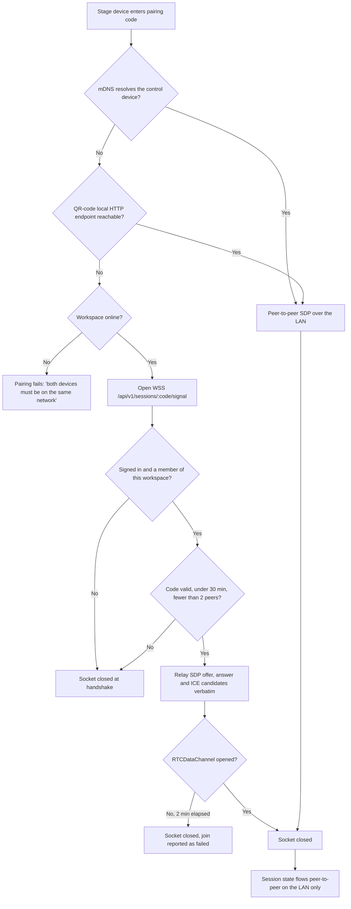

# Self-hosted WebSocket signalling for stage-view pairing

> **Amended by the [Rust rewrite](2026-09-08-rust-rewrite.md), 2026-09-08.** The long-lived process
> this document had to argue for is no longer a cost: the relay is a task inside the API binary, on
> a second port, because a tokio task can hold a socket open where PHP-FPM could not. FrankenPHP,
> Swoole and a sidecar are all moot.
> Everything else below still holds: the handshake, the room rules, the one-guest limit and the
> SDP/ICE envelope are exactly as specified.

## Context

Stage-view pairing has three signalling paths, and the last of them — the one that rescues pairing
on locked-down venue networks where mDNS is blocked and the QR-code HTTP fallback cannot reach the
control device — was a Supabase Realtime channel. Supabase is being removed
([the SQLite backend CR](2026-09-06-sqlite-backend.md)), so that path needs a replacement.

This also answers the first open question standing in the stage-view document: the fallback is
kept, not dropped. Guest wifi with client isolation is a normal venue condition, not an edge case,
and losing stage view because the network forbids peer discovery is a bad failure on a stage.

The cost is honest and worth stating: Apache with PHP-FPM cannot hold a WebSocket open, so this is
the one change in the Supabase removal that adds a piece of infrastructure rather than deleting
one.

## Current behaviour

> - if neither path is available and the workspace is online, signalling falls back to a
>   Supabase Realtime channel scoped to the session id, used **only** to exchange SDP — the
>   media/data path stays on the LAN.
>
> — [Stage view](../feature/2026-09-06-stage-view.md) § Transport and pairing rules, rule 2

> **External calls** — Supabase Realtime only as the last-resort signalling fallback, and never for
> state transport.
>
> — same document § Backend

> - [ ] Is the Supabase Realtime signalling fallback acceptable, or must pairing be strictly
>       offline even at the cost of failing on locked-down networks?
>
> — same document § Open questions

## Requested change

### A signalling endpoint owned by the application

`WSS /api/v1/sessions/{code}/signal` — a relay that carries **SDP offers, answers and ICE
candidates and nothing else**. It is a post box, not a server: it holds no session state, stores
no message, and never sees a slide, a lyric or a chord.

- **Authenticated**, using the same access token as the rest of the API. A joining device must be
  signed in and a member of the session's workspace — rule 4 of the stage-view spec, unchanged and
  now enforced at the socket handshake.
- Scoped to the pairing code, which is already a shared secret with a 30-minute expiry. A socket
  for an expired or unknown code is closed immediately.
- At most two peers per code at a time; a third connection is refused rather than queued.
- Messages are relayed verbatim to the other peer and never persisted. A message larger than 16 KB
  or not matching the SDP/ICE envelope shape is dropped and the socket closed.
- The socket closes as soon as the `RTCDataChannel` opens, or after 2 minutes without a
  successful pairing. It is a setup channel with a short life, not a connection to maintain.
- Rate limited per account: a handful of pairing attempts a minute is generous for a human
  plugging in a tablet before a service.

### Runtime

A long-lived PHP process is required. The recommendation is **FrankenPHP in worker mode**, which
serves the HTTP API and the WebSocket endpoint from one binary and keeps deployment to a single
service; Swoole or a small ReactPHP sidecar are the alternatives. This decision is not final —
see Open questions.

Whatever runs it, the signalling process needs read access to `control.sqlite` to verify tokens
and memberships, and no access to workspace databases at all.

### Ordering is unchanged

The fallback stays the **last** resort. mDNS is tried first, then the QR-code local HTTP endpoint,
and only then the relay — and only when the workspace is online. Two devices on the same LAN never
touch the server to pair.

## Unchanged

- All three transports and their order of preference; `BroadcastChannel` for same-device windows.
- The media and data path stays peer-to-peer on the LAN. The relay carries setup traffic only,
  and never session state.
- The pairing code as the session secret, its derivation of the channel name, and its 30-minute
  expiry.
- DTLS encryption of the data channel; the relay sees only what SDP already reveals.
- Heartbeats, staleness after three misses, 5-minute backoff rejoin, and the rule that a failed
  join never affects the running session.
- "Allow advance" grants, revocation, and one holder at a time.
- No new server tables. Session state remains local to the devices.

## Impact

| Area | Impact |
|---|---|
| Affected features | [Stage view](../feature/2026-09-06-stage-view.md) — pairing rule 2, External calls, and its first open question, now closed |
| Schema | None. The relay is stateless and writes nothing |
| Existing data | None |
| Breaking changes | None — no client exists |
| Operations | **Adds a long-lived process.** A plain Apache + PHP-FPM deployment is no longer sufficient, and the reverse proxy must be configured to pass WebSocket upgrades |
| Privacy | Improves on the current spec: SDP no longer transits a third party |

## Diagrams

The changed path — only what happens when the first two transports fail:

## Acceptance criteria

1. Two devices on the same LAN pair without the signalling endpoint being contacted at all.
2. On a network with client isolation and mDNS blocked, a signed-in member pairs successfully
   through the relay, and the resulting data channel carries state with the server no longer
   involved.
3. An unauthenticated socket, or one from a user who is not a member of the session's workspace,
   is closed at the handshake before any message is relayed.
4. A third device connecting with a valid code is refused while two peers are connected.
5. No session state, slide content or lyric ever crosses the relay — verified by asserting that
   every relayed payload matches the SDP/ICE envelope schema.
6. Nothing relayed is written to disk or to any database.
7. A socket with no successful pairing is closed by the server at 2 minutes.
8. A code older than 30 minutes is refused at connection, and issuing a fresh code does not
   disturb already-paired devices.
9. Killing the signalling process mid-service does not interrupt any already-paired stage view.

## Open questions

- [ ] FrankenPHP worker mode, Swoole, or a separate small sidecar? One service is simpler to
      deploy; a sidecar keeps the API on the well-understood Apache + PHP-FPM stack and lets the
      relay be restarted without dropping API traffic.
- [ ] Does pairing need a TURN server for the case where two devices are on the same venue wifi
      but client-isolated from each other? Signalling would succeed and the data channel would
      still fail — which is the exact scenario this CR is meant to rescue, and relaying media
      through a server is a much larger commitment than relaying SDP.
- [ ] Should a personal workspace allow a second device to join without a full sign-in — the
      stage-view document's second open question, still open and now interacting with the
      handshake check specified here.
