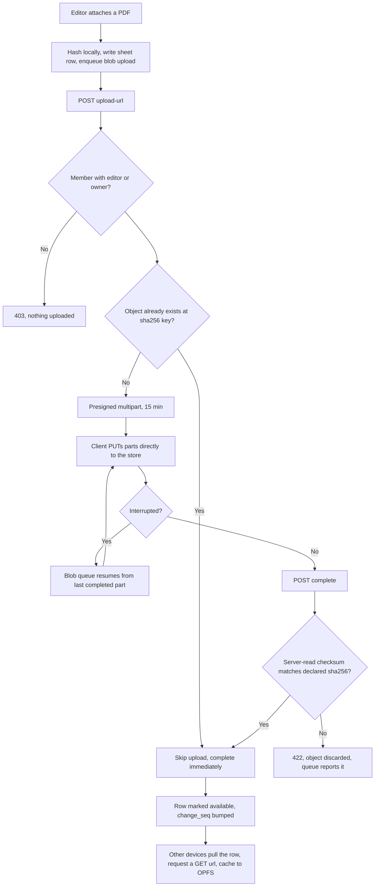

# Sheet PDFs on S3-compatible object storage

## Context

Supabase Storage disappears with the rest of Supabase (see
[the SQLite backend CR](2026-09-06-sqlite-backend.md)), and sheet PDFs need somewhere else to
live. Storing them as BLOBs inside the workspace SQLite file was rejected: sheets are megabytes
each and that file is read on every sync, so it would be paying page-cache and backup cost on
binary data that is never queried.

S3-compatible storage keeps the two properties the sheet-attachments spec already depends on —
presigned URLs and resumable upload — and keeps the app server stateless, so it does not become
the thing that must be backed up alongside the databases.

## Current behaviour

> | POST | `/storage/v1/object/sheets/{workspace}/{sheet}` | Supabase Storage upload | `editor`, `owner` |
> | GET | `/storage/v1/object/sign/sheets/...` | signed URL, 1 h | member |
>
> — [Sheet attachments — PDFs per key](../feature/2026-09-06-sheet-attachments.md) § Backend

> 2. Storage path is `sheets/{workspace_id}/{sheet_id}.{ext}`; the object is private and only ever
>    served through a signed URL or from the local cache.
>
> — same document § Business rules

> **Migration** — initial. A Storage bucket `sheets` with RLS policies mirroring workspace
> membership.
>
> — same document § Data storage

## Requested change

### Storage backend

Any S3-compatible object store, behind an `ObjectStore` interface with one implementation
(`aws/aws-sdk-php`, path-style addressing so MinIO and the rest work unchanged). MinIO in the
development Compose stack; whichever provider the deployment prefers in production.

### Object keys are content-addressed

The key becomes `sheets/{workspace_id}/{sha256}.pdf` rather than `{sheet_id}.{ext}`.

The `sha256` is already on the sheet row today, and business rule 3 already says a replace
producing the same hash is a no-op. Keying by hash makes that automatic rather than a check:
re-uploading identical bytes writes to the same key, and a file replace becomes a new object
rather than a mutation of an existing one, so a device holding the old URL is never served
different bytes than it cached. `workspace_id` stays in the key even though the content database
no longer has the column — it comes from the route, and it keeps a workspace's objects deletable
and countable as one prefix.

### Access control

**Object-store credentials are never exposed to the client.** RLS policies on a storage bucket are
gone; the server is the only holder of credentials and mints short-lived presigned URLs after
checking membership through the same `WorkspaceMiddleware` gate as everything else:

| Method | Path | Returns | Permission |
|---|---|---|---|
| POST | `/api/v1/workspaces/{workspace}/sheets/{sheet}/upload-url` | presigned PUT or multipart upload id, 15 min | `editor`, `owner` |
| POST | `/api/v1/workspaces/{workspace}/sheets/{sheet}/upload-part` | presigned part URL | `editor`, `owner` |
| POST | `/api/v1/workspaces/{workspace}/sheets/{sheet}/complete` | finalises multipart, records `sha256` and `size` on the row | `editor`, `owner` |
| GET | `/api/v1/workspaces/{workspace}/sheets/{sheet}/url` | presigned GET, 1 h | member |

Upload URLs are 15 minutes rather than an hour: they are used immediately by the blob queue,
and a leaked write URL is worse than a leaked read URL.

**The server verifies the hash on completion.** The client declares a `sha256`; the server reads
the stored object's checksum and refuses the completion if it disagrees, so a content-addressed
key can never point at bytes that do not match it.

### Bucket configuration

- One bucket, private, no public access policy, versioning off.
- Server-side encryption at rest enabled where the provider offers it.
- CORS allows `PUT`/`GET` from the app origin only, since the client uploads and downloads
  directly to the store rather than proxying through the API.
- A lifecycle rule aborts incomplete multipart uploads after 7 days, so an abandoned resumable
  upload does not accrue cost forever.
- Purging on the 30-day soft-delete window (business rule 6) becomes a `DeleteObjects` batch in
  the same nightly job.

## Unchanged

- The row-and-file split: a sheet row may exist with no file, and that is the "not downloaded"
  state, not an error.
- The blob queue, its resumability, its retry policy, and the rule that blob sync never blocks
  metadata sync.
- `sha256` on the sheet row, and the rule that a different hash invalidates every device's cached
  copy on next sync.
- Sheet selection order, capo behaviour, and everything about how a sheet is chosen for a key.
- Annotation storage and normalised coordinates.
- Client-side caching in OPFS, the pin policy, and LRU eviction of opportunistic blobs.
- The 1-hour read URL lifetime, and transparent refresh once when it expires mid-read.

## Impact

| Area | Impact |
|---|---|
| Affected features | [Sheet attachments](../feature/2026-09-06-sheet-attachments.md) — Backend table, business rule 2, Migration, External calls. [Sync engine](../feature/2026-09-06-offline-storage-and-sync.md) — the two `/storage/v1/...` rows of its endpoint table |
| Schema | None in SQLite. `sheets.sha256` and `sheets.size` already exist and now also key the object |
| Existing data | None — no files exist |
| Breaking changes | Storage URLs change shape; the client obtains every URL from the API rather than constructing one |
| Operations | A second stateful dependency: workspace databases and sheet objects must be backed up together, or a restore yields rows whose files are missing |

## Diagrams

## Acceptance criteria

1. A non-member requesting an upload or download URL for a sheet is refused, and no presigned URL
   is generated.
2. No object-store credential ever reaches the client; the only thing it receives is a presigned
   URL with an expiry.
3. Uploading a PDF whose bytes are already stored for that workspace completes without
   transferring the file a second time.
4. A completion whose declared `sha256` disagrees with the stored object is rejected and the
   object is not linked to the row.
5. An upload interrupted at 60% resumes from the last completed part after the app is relaunched;
   the file is not re-sent from zero.
6. Replacing a sheet's file leaves the previous object untouched until the 30-day purge, and a
   device holding the old URL continues to receive the bytes it cached.
7. Deleting a workspace removes every object under its prefix, verified by a prefix listing
   returning empty.
8. A presigned upload URL is unusable 16 minutes after it is issued.
9. `docker compose up` provides a working store with a created bucket and no cloud account.

## Open questions

- [ ] Should a self-hosting deployment be able to choose a filesystem-backed `ObjectStore`
      implementation instead of running MinIO, or is S3-compatible a hard requirement?
- [ ] Is a per-workspace storage quota needed, and is it enforced at upload-url issue time or
      discovered on completion?
- [ ] Should the nightly purge verify against the object store that every non-deleted row has its
      file, and surface orphaned rows or orphaned objects somewhere an operator sees them?
- [ ] Does the deployment want a CDN in front of read URLs, given presigned URLs and caching
      interact badly unless the expiry is aligned to the cache TTL?
