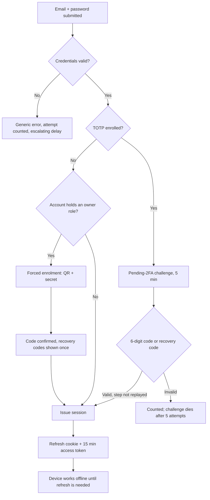
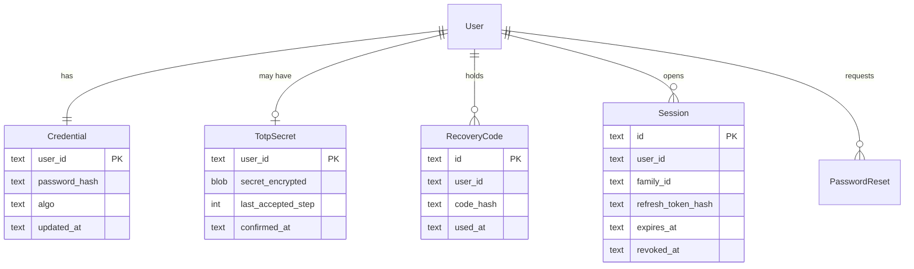

# Self-hosted email + password sign-in with TOTP two-factor

## Context

Supabase Auth is removed along with the rest of Supabase (see
[the SQLite backend CR](2026-09-06-sqlite-backend.md)), so sign-in has to be owned by the
application. Reimplementing Google and Apple OAuth was rejected: it needs an Apple developer
account and per-deployment client secrets, which is heavy for a product whose whole point is that
a band's library works without a cloud.

Two-factor moves in the other direction. A workspace `owner` can add and remove members, transfer
ownership and delete the entire library, so their account is worth protecting properly — while a
musician borrowing the drummer's tablet to read a chart should not be stopped at an authenticator
enrolment screen. Hence TOTP that is optional for everyone and mandatory for owners.

## Current behaviour

> - Email + password and OAuth (Google, Apple) sign-in via Supabase Auth.
>
> — [Accounts, workspaces and access control](../feature/2026-09-06-workspaces-and-access.md) § Scope

> | POST | `/auth/v1/token` | Supabase Auth | public |
>
> — same document § Backend

> **External calls** — Google and Apple OAuth through Supabase Auth. When unavailable, email
> sign-in and local-only mode both remain available; the OAuth buttons show a disabled state.
>
> — same document § Backend

There is no second factor anywhere in the current specification.

## Requested change

### Sign-in

Email and password, owned by the application. **Google and Apple sign-in are removed** from the
scope, along with the OAuth buttons and their disabled state.

- Passwords hashed with Argon2id via `password_hash()`, rehashed on sign-in when the cost
  parameters have moved.
- Session is a pair: a long-lived opaque refresh token in an `httpOnly`, `Secure`, `SameSite=Lax`
  cookie, and a short-lived (15 min) access token the sync engine sends as a bearer header. The
  refresh token is stored hashed in `control.sqlite`, so a database read cannot impersonate.
- Refresh tokens rotate on use. A token presented twice invalidates the whole session family —
  the standard reuse-detection response to a stolen cookie.
- Rate limiting per email and per IP: escalating delay after 5 failures, and a generic
  "email or password is incorrect" that does not disclose whether the account exists.
- Password reset by emailed single-use token, 1 hour expiry, which invalidates every session.

### Two-factor (TOTP)

- RFC 6238 TOTP, 30-second step, 6 digits, one step of clock drift accepted either side.
- The shared secret is encrypted at rest in `control.sqlite` with a key from the application
  environment, not stored in plaintext.
- Enrolment shows a QR code plus the secret, and is **only** confirmed once the user has entered a
  valid code — never armed on display, so a half-finished enrolment cannot lock anyone out.
- Ten single-use recovery codes are issued at enrolment, shown exactly once, stored hashed.
- **Mandatory for `owner` of a *band* workspace.** Accepting such an owner role, or being
  promoted to one, requires TOTP: a user without it is sent to enrolment before the promotion
  commits. Promoting someone who has not enrolled is refused with an explanatory error, not
  queued.
- **The personal workspace is excluded**, and this exclusion is load-bearing rather than a
  detail. Every account owns its personal workspace by definition, so without carving it out
  "mandatory for owners" would mean mandatory for everyone — which is exactly the outcome this
  option was chosen to avoid. An account that owns nothing but its own library is never forced
  through enrolment.
- Optional for `editor` and `viewer`, enabled from account settings at any time.
- Disabling TOTP requires the current password and a valid code, and is refused outright while
  the account holds any `owner` role.
- A replayed code within its own 30-second window is refused: the last accepted step is recorded
  per user.

### Effect on offline and local-only mode

Unchanged in behaviour, and this is the part worth being explicit about: **the second factor is
required to obtain a session, never to use the app.** A device with a valid refresh token opens
the library offline with no prompt, exactly as specified today. TOTP is asked for at sign-in and
at sensitive account changes, both of which already require the network.

## Unchanged

- Local-only anonymous mode, the client-generated workspace UUID, and claiming it on first
  sign-in.
- Sign-out semantics, including "also remove downloaded songs from this device".
- Offline launch reaching the last-used workspace with no sign-in screen.
- The invite flow, its 14-day expiry, single use, and binding to the invited email.
- All three roles and their permissions.

## Impact

| Area | Impact |
|---|---|
| Affected features | [Accounts, workspaces and access control](../feature/2026-09-06-workspaces-and-access.md) — Scope bullet 1, the Backend endpoint table, business rules, and Data storage |
| Schema | New in `control.sqlite`: `credentials`, `totp_secrets`, `recovery_codes`, `sessions`, `password_resets`, `login_attempts`. `users` gains `email_verified_at` |
| Existing data | None — no accounts exist |
| Breaking changes | `/auth/v1/token` is replaced; Google and Apple sign-in are withdrawn from scope before any implementation |

**New endpoints**

| Method | Path | Permission |
|---|---|---|
| POST | `/api/v1/auth/register` | public |
| POST | `/api/v1/auth/login` | public — returns `totp_required` instead of a session when enrolled |
| POST | `/api/v1/auth/login/totp` | holder of a valid pending-2FA challenge |
| POST | `/api/v1/auth/refresh` | valid refresh cookie |
| POST | `/api/v1/auth/logout` | authenticated |
| POST | `/api/v1/auth/password/forgot` | public |
| POST | `/api/v1/auth/password/reset` | valid reset token |
| POST | `/api/v1/account/totp/enrol` | authenticated |
| POST | `/api/v1/account/totp/confirm` | authenticated, pending enrolment |
| DELETE | `/api/v1/account/totp` | authenticated, password + code, no `owner` role held |
| POST | `/api/v1/account/totp/recovery-codes` | authenticated, password + code |

## Diagrams

## Acceptance criteria

1. A user with TOTP enrolled cannot obtain a session with the password alone; the login response
   carries a challenge, never a token.
2. A user promoted to `owner` without TOTP is routed to enrolment, and the promotion is not
   recorded until a code is confirmed.
3. An `owner` attempting to disable TOTP is refused, with a message naming the role that blocks
   it.
4. Each recovery code works exactly once; the tenth use leaves zero remaining and the account
   settings page says so.
5. A TOTP code accepted at step *n* is refused if replayed inside the same 30-second window.
6. A refresh token presented a second time revokes every session in its family, and the user is
   signed out on all devices.
7. Six wrong passwords in a minute produce escalating delays, and the response never reveals
   whether the email is registered.
8. With the network disabled, an installed app whose refresh token is still valid reaches the
   library with no sign-in and no TOTP prompt.
9. An enrolment abandoned before the confirming code is entered leaves the account with no second
   factor and a working password sign-in.

## Open questions

- [ ] Is email verification required before a workspace can be created, or only before invites
      can be sent? Unverified accounts inviting others is the abuse path worth closing.
- [ ] Should there be a "remember this device for 30 days" option that skips TOTP on a known
      device, given musicians sign in on their own phones repeatedly?
- [ ] What happens to a workspace whose sole owner loses both their authenticator and their
      recovery codes? On a hosted service this needs a documented, human-verified path or the
      library is unrecoverable.
- [ ] Are WebAuthn passkeys wanted later as an alternative second factor, and if so should the
      schema be shaped for multiple factors per account now rather than a single TOTP secret?
