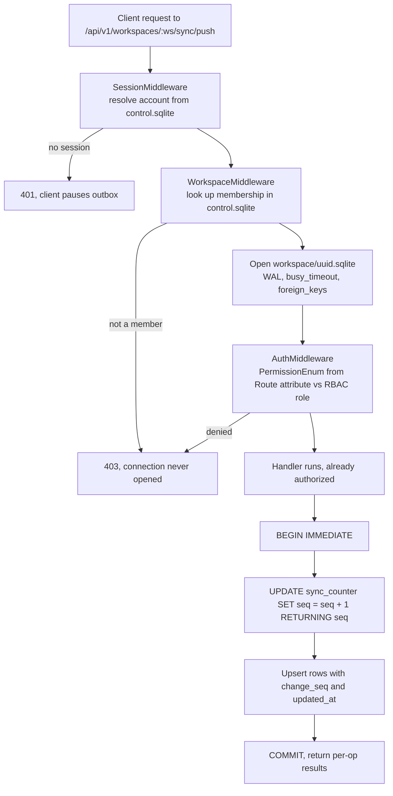
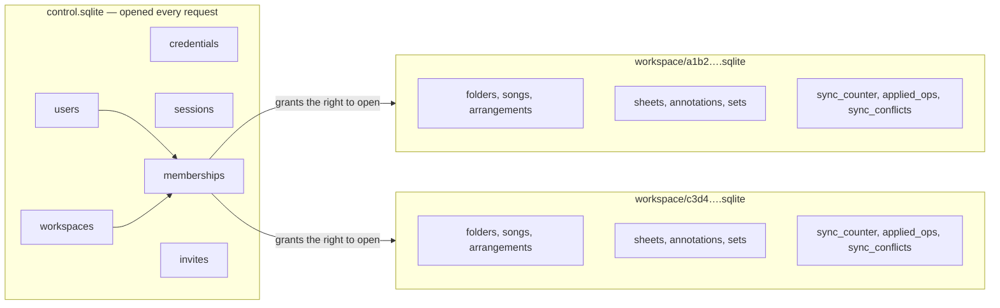

# Self-hosted PHP backend on SQLite, replacing Supabase

> **Amended by the [Rust rewrite](2026-09-08-rust-rewrite.md), 2026-09-08.** The server named here
> is Rust and axum rather than PHP and Mezzio, and the client is Leptos compiled to WebAssembly
> rather than React and Vite.
> Everything else below still holds: the database is still SQLite, still one file per workspace plus
> `control.sqlite`, still built from these migrations, and every rule in this document is unchanged.

## Context

Every feature was specified against Supabase before any code was written. Supabase was carrying
five separate jobs — Postgres, row-level security, Auth, Storage and Realtime — and the decision
to move the database to SQLite unpicks all five. This document covers the database and the
server that owns it; the other three jobs are separate change requests, listed under *Related*.

The workload argues for it. A band's entire library is metadata plus ChordPro text — kilobytes,
not gigabytes — with a handful of writers who are usually offline anyway. That is a SQLite
workload, and a Postgres cluster per deployment is infrastructure bought for a load that will
never arrive. Giving each workspace its own database file also converts the security boundary
from a policy that must be correct into a file that is simply not opened.

Local development gains directly: the same engine runs in development and production, so there
is no Supabase emulator, no container to keep in sync with the hosted project, and a test fixture
is a file that can be copied.

## Current behaviour

> **Stack** — React 19 + TypeScript + Vite, Tailwind, Dexie over IndexedDB, Workbox service
> worker, `pdf.js` for sheet rendering. Supabase (Postgres 16, Auth, Storage) for sync.
>
> — [overview](../overview.md) § Constraints

> Postgres row-level security is the enforcement point; the client mirrors the same rules to
> hide controls, but never as the only check.
>
> — [overview](../overview.md) § Authorization model

> Supabase-hosted; "endpoint" means a PostgREST table with RLS or an Edge Function.
>
> — [Accounts, workspaces and access control](../feature/2026-09-06-workspaces-and-access.md) §
> Backend

> Every synced table carries `updated_at` and a server-maintained `change_seq` (a bigint from a
> per-workspace sequence).
>
> — [Offline storage and sync engine](../feature/2026-09-06-offline-storage-and-sync.md) § Business
> rules

## Requested change

### Server runtime

An API-only PHP application: PHP 8.4, Mezzio 3 (PSR-15), `laminas-router`, `#[Route]` attributes
discovered by `tempest/discovery`, `laminas-servicemanager` for DI. **No Inertia, Twig or Vue** —
the client is the existing React PWA and talks JSON over `/api/v1/…`. Supabase Edge Functions
become request handlers; PostgREST table URLs become explicit endpoints.

### Two tiers of database

One SQLite file per workspace cannot answer "which workspaces does this email belong to", so
identity is separated from content:

| File | Holds | Opened |
|---|---|---|
| `control.sqlite` | `users`, `credentials`, `sessions`, `workspaces`, `memberships`, `invites` | every request |
| `workspace/<uuid>.sqlite` | `folders`, `songs`, `arrangements`, `sheets`, `annotations`, `sets`, `set_items`, `preferences`, `applied_ops`, `sync_conflicts` | only after membership is verified |

Content tables **drop `workspace_id` entirely** — the file is the scope. This removes the
denormalised column called out as "denormalised for RLS" in the sets, sheets and chord-charts
documents, and removes the class of bug where a query forgets the predicate.

Creating a workspace creates its file and runs the workspace migration set against it. Deleting
a workspace deletes one file. Exporting a workspace is a file copy.

### Authorization: RBAC replaces RLS

SQLite has no row-level security, so the database enforces nothing and the server must be the
only gate. Two middlewares run before every dispatch:

1. `WorkspaceMiddleware` reads the `{workspace}` route segment, looks the membership up in
   `control.sqlite`, and **only on success** opens that workspace's connection and attaches it to
   the request. A handler physically cannot reach a workspace the caller is not a member of,
   because it is never handed the connection.
2. `AuthMiddleware` resolves the `PermissionEnum` declared in `#[Route(options: ...)]` against
   `laminas-permissions-rbac`, using the role from the membership row. A handler that runs is
   already authorized and does not re-check.

Role is read from the membership row, never from a client claim — unchanged in substance from
business rule 6 of the workspaces feature; only the enforcement mechanism moves.

### Persistence layer

Raw PDO over `doctrine/dbal` connections, **no ORM**. This subsystem moves rows between two
databases and does bulk upserts; an identity map and a unit of work are overhead against that.
Migrations are numbered plain-SQL files in two sets — `migrations/control/` and
`migrations/workspace/` — applied by `bin/aurum migrate`, which walks every workspace file and
records progress in a `schema_version` row inside each. A workspace file that is behind is
migrated on open, so a file restored from an old backup repairs itself.

### Type and idiom mapping

| Postgres | SQLite | Note |
|---|---|---|
| `uuid` | `TEXT` | canonical UUIDv7 string; lexicographic order is chronological, so no separate `created_at` index |
| `timestamptz` | `TEXT` | ISO-8601 UTC, `YYYY-MM-DDTHH:MM:SS.sssZ` — fixed width, so string comparison is time comparison |
| `jsonb` | `TEXT` | `CHECK (json_valid(col))`, queried with the `json1` extension |
| `citext` | `TEXT COLLATE NOCASE` | used for `users.email` and `invites.email` |
| `bigint` | `INTEGER` | SQLite integers are already 64-bit |
| sequence | counter row | see below |
| trigger-set `updated_at` | `AFTER UPDATE` trigger | SQLite triggers are sufficient for this |

**`change_seq` without a sequence.** Each workspace file holds a single-row `sync_counter` table.
Every write transaction opens `BEGIN IMMEDIATE` and takes the next value:

```sql
UPDATE sync_counter SET seq = seq + 1 RETURNING seq;
```

One writer per file makes this strictly serialised — the same monotonic, skew-immune ordering the
per-workspace Postgres sequence provided, with no sequence type and no gaps.

**Connection pragmas**, applied on open: `journal_mode=WAL` (readers never block the writer),
`busy_timeout=5000` (PHP-FPM is multi-process, so writers must queue rather than fail),
`foreign_keys=ON` (off by default in SQLite), `synchronous=NORMAL` (safe under WAL).

### Endpoint mapping

| Was | Becomes | Permission |
|---|---|---|
| `GET /rest/v1/workspaces` | `GET /api/v1/workspaces` | authenticated; lists from `memberships` |
| `POST /rest/v1/workspaces` | `POST /api/v1/workspaces` | authenticated |
| `GET /rest/v1/memberships?workspace_id=eq.X` | `GET /api/v1/workspaces/{workspace}/members` | member |
| `PATCH /rest/v1/memberships` | `PATCH /api/v1/workspaces/{workspace}/members/{user}` | `owner` |
| `POST /functions/v1/invite` | `POST /api/v1/workspaces/{workspace}/invites` | `owner` |
| `POST /functions/v1/invite-accept` | `POST /api/v1/invites/{token}/accept` | authenticated |
| `POST /functions/v1/claim-local-workspace` | `POST /api/v1/workspaces/claim` | authenticated |
| `POST /functions/v1/sync-push` | `POST /api/v1/workspaces/{workspace}/sync/push` | member, role-checked per table |
| `GET /functions/v1/sync-pull?since=` | `GET /api/v1/workspaces/{workspace}/sync/pull?since=` | member |
| `GET/POST /rest/v1/{table}` (library, sets, charts) | folded into `sync/push` and `sync/pull` | member |

The per-table PostgREST endpoints in the song-library, sets, chord-charts and sheet-attachments
documents are not reproduced one-for-one. Those documents describe them as the delta pull and the
sync-queue upsert; both are already the sync endpoints, so the sync pair is the whole data API.

### Local development

Docker Compose loses MariaDB and Valkey; the app service mounts `./var/data` for `control.sqlite`
and the workspace directory. MailHog stays for invite mail. Production and development run the
identical engine, so "works locally" stops being a claim about a different database.

## Unchanged

- **The client is untouched.** React 19 + Vite, Dexie over IndexedDB as the local source of
  truth, OPFS for PDFs, Workbox. SQLite is a server-side change only; no SQLite WASM in the app.
- **The sync algorithm.** Client-generated UUIDv7 ids, ordered outbox, per-field last-writer-wins
  by `updated_at`, tombstones winning over edits, `applied_ops` idempotency, the pin and eviction
  policy, the sync status UI. Only the server implementing it changes.
- **Roles and their meaning.** `owner` / `editor` / `viewer`, and the rule that a workspace always
  has at least one owner.
- **Offline-first behaviour.** Every read and write path still works with the radio off.
- **Anonymous local-only mode** and the client-generated workspace UUID on claim.

## Impact

| Area | Impact |
|---|---|
| Affected features | [Workspaces and access](../feature/2026-09-06-workspaces-and-access.md) (backend, migration), [Sync engine](../feature/2026-09-06-offline-storage-and-sync.md) (server endpoints, `change_seq`), [Song library](../feature/2026-09-06-song-library.md) (cycle-check trigger), [Chord charts](../feature/2026-09-06-chord-charts-and-transposition.md), [Sets](../feature/2026-09-06-sets.md), [Sheet attachments](../feature/2026-09-06-sheet-attachments.md) (`workspace_id` removal), [PWA installation](../feature/2026-09-06-pwa-installation.md) (cache rules name Supabase hosts) |
| Overview | Supersedes three parts of [overview.md](../overview.md) on approval: the *Sync service* actor, the *Cloud* subgraph of the context diagram, and the Stack and Authorization-model paragraphs. Left as written until this CR is Approved, so the review gate stays intact. |
| Schema | Every content table drops `workspace_id`; Postgres types map as tabled above; per-workspace `sync_counter` replaces the sequence; RLS policies and the `current_role()` helper are deleted, not ported |
| Existing data | **None.** No code has been written and no deployment exists — this is a change to specification only, so there is no backfill and no migration path from Supabase |
| Breaking changes | All PostgREST and Edge Function URLs are replaced by `/api/v1/…`. No client exists yet, so nothing in the field breaks |

## Diagrams

The changed path — one request, and where authorization now happens:



File layout — identity in one database, content in one file per workspace:



## Acceptance criteria

1. A request for a workspace the caller is not a member of returns 403 and the workspace's
   database file is never opened — verifiable by asserting no file handle is created on the
   denied path, not merely that the response was 403.
2. No content table contains a `workspace_id` column, and no query in the codebase filters on
   one.
3. Two concurrent push requests to the same workspace produce strictly increasing, gap-free
   `change_seq` values, and a pull with `since=<n>` returns every row written after `n` exactly
   once.
4. Twenty concurrent writes to one workspace file all commit; none fails with `SQLITE_BUSY`.
5. Creating a workspace produces a file that passes `PRAGMA integrity_check`, and deleting the
   workspace leaves no file behind.
6. `bin/aurum migrate` brings a workspace file created three migrations ago up to date on open,
   without touching the other workspace files.
7. A `viewer` calling `PATCH /api/v1/workspaces/{ws}/members/{user}` is refused by
   `AuthMiddleware` before the handler is entered.
8. A developer clone runs `docker compose up` and reaches a working API with no Supabase
   credentials, no external service, and no database container.
9. Sheet PDFs excepted, a full workspace round-trips through export and import as a single file
   copy, with identical row counts and `change_seq` values.

## Open questions

- [ ] What is the backup unit — a per-file `VACUUM INTO` snapshot on a schedule, or Litestream-
      style WAL shipping per workspace? The second scales to many files but is another daemon.
- [ ] Is there a ceiling on workspaces per host before "walk every file" operations (migrate,
      purge, backup) become slow enough to need a work queue?
- [ ] Does anything still need Valkey once Postgres is gone — sessions and rate limiting could
      live in `control.sqlite`, at the cost of write contention on a single hot file.
- [ ] How does a workspace move between hosts if deployment ever scales past one server?
      Per-workspace files make this a copy, but there is no story yet for who owns the routing.
- [ ] The song-library feature specifies a Postgres trigger that rejects folder cycles. Confirm
      the SQLite recursive-CTE equivalent runs on write rather than deferring to a client check.
