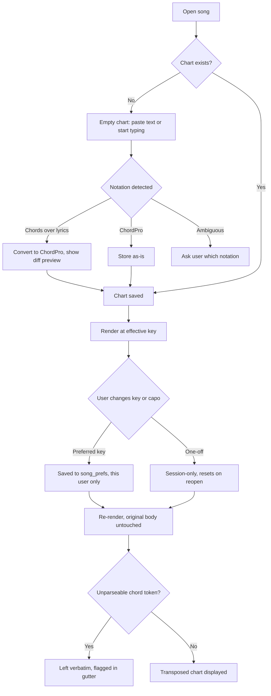
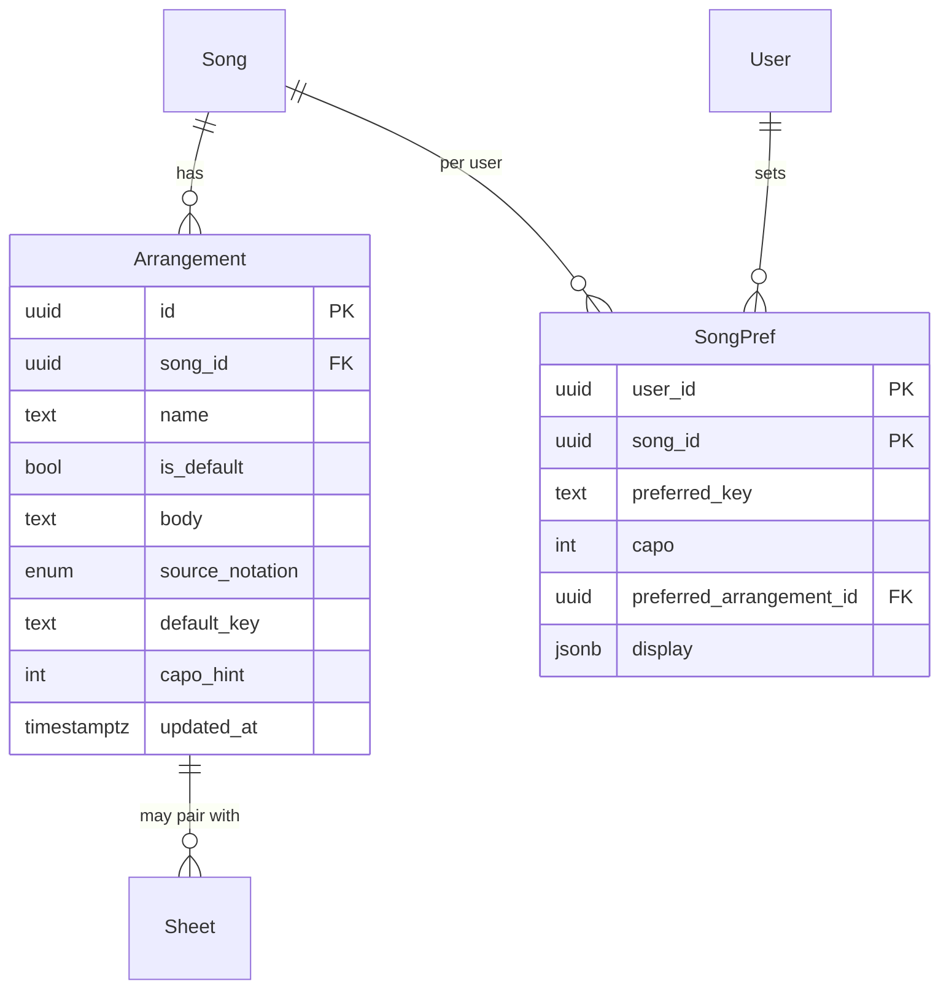

# Chord charts, arrangements and transposition

## Purpose

Every musician in a band wants the same song in a different key, and today that means someone
retypes the chart or scribbles on a printout. This feature defines how a chart is stored, how
two different source notations are accepted, and how the app re-letters chords to any key or
capo position on the fly — without ever mutating the original chart.

## Scope

- Canonical storage of a chart as **ChordPro** text (`[G]` inline brackets, `{directives}`).
- Paste or import of **chords-over-lyrics** text (SongbookPro, OnSong, Ultimate Guitar style),
  converted to ChordPro on entry.
- Rendering in either layout: inline brackets or chords-over-lyrics, as a per-user display
  preference.
- Multiple named **arrangements** per song, each with its own body and default key.
- Transposition to any of the 12 keys, by semitone or by target key, with correct enharmonic
  spelling for the target key.
- Capo mode: chord shapes shown for a capo position while the sounding key is unchanged.
- Nashville number system as a display mode.
- Per-user preferred key per song, and per-set key overrides that win during a set.
- Section directives (`{verse}`, `{chorus}`, `{bridge}`) that also drive presenter slides.
- Chart editor with live preview, autosave and a chord-validity gutter.

**Not in scope**

- OCR or chord extraction from PDFs. Sheets are separate; see the sheet attachments feature.
- Audio pitch detection or automatic key detection from a recording.
- Chord diagrams / fretboard fingerings (candidate for a later change request).
- Rewriting a chart's *content* on transpose — transposition is always a display transform.

## User journey

Opening a song renders its chart at the *effective key* — the set override if the song is being
viewed inside a set, else the user's preferred key, else the arrangement's default key. Changing
the key re-renders instantly from the parsed model; the stored ChordPro is never rewritten, so
two members can read the same chart in different keys at the same time.

## Frontend

**Pages / views**

| View | Route | New or modified |
|---|---|---|
| Chart view | `/song/:songId` (default tab) | New |
| Chart editor | `/song/:songId/edit` | New |
| Arrangement switcher | dropdown in the chart header | New |
| Key & capo control | popover in the chart header | New |
| Paste/convert dialog | modal over the editor | New |

**Entry points** — opening a song from the library or a set; the "edit chart" action; paste
into an empty chart area.

**States**

| State | Behaviour |
|---|---|
| Empty | "No chart yet" with paste area and a link to attach a PDF sheet instead |
| Loading | Rendered synchronously from IndexedDB; no spinner on a local song |
| Error | A chart that fails to parse still displays as monospace plain text with a banner naming the first bad line |
| Permission denied | `viewer` sees the chart and all transposition controls, but no edit affordance |
| Offline | Fully functional; parsing and transposition are pure client-side |

**Display preferences** (per user, per device): notation layout (inline / over-lyrics /
Nashville), font size, column count (1 or 2), chords-only mode (lyrics hidden), lyrics-only
mode, dark/stage theme, and whether to show section labels.

**Validation** — the editor flags tokens in bracket position that are not valid chords, but
never blocks saving. Directive names are autocompleted. Autosave is debounced 800 ms and on blur.

## Backend

Parsing, transposition and rendering are entirely client-side and offline. The server stores and
replicates chart text only.

| Method | Path | Handler | Permission |
|---|---|---|---|
| GET | `/rest/v1/arrangements?song_id=eq.X` | delta pull | member |
| POST | `/rest/v1/arrangements` | upsert from sync queue | `editor`, `owner` |
| PATCH | `/rest/v1/arrangements?id=eq.X` | upsert from sync queue | `editor`, `owner` |
| GET/POST | `/rest/v1/song_prefs` | per-user upsert | own rows only |

**Business rules — notation and parsing**

1. Canonical storage is ChordPro. Chords-over-lyrics input is converted on entry; the original
   pasted text is retained in `source_text` for one round of undo and for debugging conversions.
2. Chords-over-lyrics detection: a line is a chord line when every whitespace-separated token
   matches the chord grammar and the line has at least one token. A chord line binds to the next
   non-blank line; column position maps to character offset in the lyric line.
3. The chord grammar is: root `[A-G]`, optional accidental `#|b|♯|♭`, optional quality
   (`m`, `maj`, `min`, `dim`, `aug`, `sus2`, `sus4`, `add9`, numeric extensions, alterations),
   optional bass `/[A-G][#b]?`. Anything else in bracket position is left verbatim and flagged.
4. Section directives recognised: `{title}`, `{subtitle}`, `{artist}`, `{key}`, `{tempo}`,
   `{time}`, `{capo}`, `{comment}`, `{start_of_verse}`/`{sov}`, `{soc}`, `{sob}`, and the
   shorthand `{verse}`, `{chorus}`, `{bridge}`, `{tag}`, `{intro}`, `{outro}`, with optional
   labels (`{verse: 2}`).
5. A chart is parsed once into a section model, memoised per `(arrangement_id, updated_at)`.
   Transposition operates on that model, never by string replacement on the raw text.

**Business rules — transposition**

6. Transposition is a display transform. `body` is immutable under key changes; only the
   rendered output differs.
7. The effective key resolves in this order: set-item override → user preferred key →
   arrangement default key → song `original_key`. The first non-null wins, and the UI shows
   which level supplied it.
8. Enharmonic spelling follows the target key signature, not a fixed sharp/flat table: in Db
   major the fourth is Gb, not F#; in B major it is E, and the raised fourth is E#, not F. The
   implementation uses key-signature-aware note spelling with a circle-of-fifths lookup.
9. Minor keys use their relative major's signature for spelling. `Am` → transposing up 3
   semitones yields `Cm`, spelled with the Eb-major signature.
10. Slash-chord bass notes transpose by the same interval and follow the same spelling rules.
11. Capo: with capo at fret `n` and sounding key `K`, chord shapes are rendered in key
    `K - n` semitones and the header states "Capo n — sounding in K". Capo never changes the
    sounding key, and never changes which sheet PDF is offered.
12. Nashville mode renders scale degrees relative to the effective key, with quality suffixes
    preserved and `4/6` style slash degrees.
13. Transposing beyond ±11 semitones normalises into one octave; the UI offers both "up to" and
    "down to" for the same target key and picks the smaller interval by default.
14. Double accidentals are avoided in output: if a spelling would produce `Fx` or `Bbb`, the
    renderer falls back to the simpler enharmonic and marks the chart's key as "respelled".

**Failure behaviour** — an unparseable chart never blocks reading: it falls back to preformatted
text with the original notation. Unrecognised chord tokens render verbatim in chord position and
are listed in the editor gutter. Neither state prevents saving or syncing.

**Asynchronous work** — parsing of charts over 500 lines runs in the same Web Worker as the
search index. None otherwise.

**External calls** — none.

## Data storage

**New entities**

| Entity | Field | Type | Null | Notes |
|---|---|---|---|---|
| `arrangements` | `id` | uuid | no | PK, UUIDv7 |
| | `song_id` | uuid | no | FK, cascade |
| | `workspace_id` | uuid | no | denormalised for RLS |
| | `name` | text | no | e.g. "Default", "Acoustic" |
| | `is_default` | bool | no | exactly one true per song |
| | `body` | text | no | canonical ChordPro |
| | `source_notation` | enum | no | `chordpro` \| `over_lyrics` — what was pasted |
| | `source_text` | text | yes | pre-conversion original, retained for one undo |
| | `default_key` | text | yes | overrides `songs.original_key` for this arrangement |
| | `capo_hint` | int | yes | 0–11, the arranger's suggested capo |
| | `deleted_at` | timestamptz | yes | |
| | `updated_at` | timestamptz | no | |
| `song_prefs` | `user_id` + `song_id` | uuid | no | composite PK, per-user, synced |
| | `preferred_key` | text | yes | |
| | `capo` | int | yes | |
| | `preferred_arrangement_id` | uuid | yes | FK |
| | `display` | jsonb | no | notation layout, font size, columns |

**Modified entities** — `songs`: none. `original_key` already exists from the library feature
and remains the last-resort key source.

**Indexes** — `arrangements (song_id)`; `arrangements (workspace_id, updated_at)` for delta
pull; partial unique `arrangements (song_id) where is_default`; `song_prefs (user_id,
song_id)` PK covers lookups.

**Migration** — created with the library migration. Importing a legacy library backfills one
`Default` arrangement per song from the imported file.

## Acceptance criteria

1. Pasting a chords-over-lyrics block produces a ChordPro body whose rendered over-lyrics view
   places every chord at the same character column as the pasted original.
2. A chart in C transposed to Db renders `Gb`, not `F#`; the same chart transposed to B renders
   `F#`, not `Gb`.
3. `Am7/G` transposed up 5 semitones renders `Dm7/C`.
4. Setting capo 2 on a chart sounding in D shows chord shapes in C and a header reading
   "Capo 2 — sounding in D"; the D-key PDF sheet remains the one offered.
5. Two users viewing the same song at the same time see their own preferred keys, and neither
   sees the other's; the stored `body` is byte-identical before and after both views.
6. A chart containing the token `[Hmm]` renders `Hmm` verbatim in chord position, flags it in
   the editor gutter, and saves without error.
7. Nashville mode on a chart in G renders `G C D Em` as `1 4 5 6m`.
8. With the network disabled, changing key, capo, arrangement and notation layout all work and
   the preferred key persists across an app restart.

## Open questions

- [ ] Should `preferred_key` be per user per song globally, or per user per workspace copy of
      the song? Currently global per user.
- [ ] Do we store a parsed section model server-side for the presenter, or always parse on the
      client? Currently always client.
- [ ] Should chords-over-lyrics conversion be reversible on export, or is ChordPro export enough?
- [ ] Are chord diagrams wanted in the first release, or deferred?
