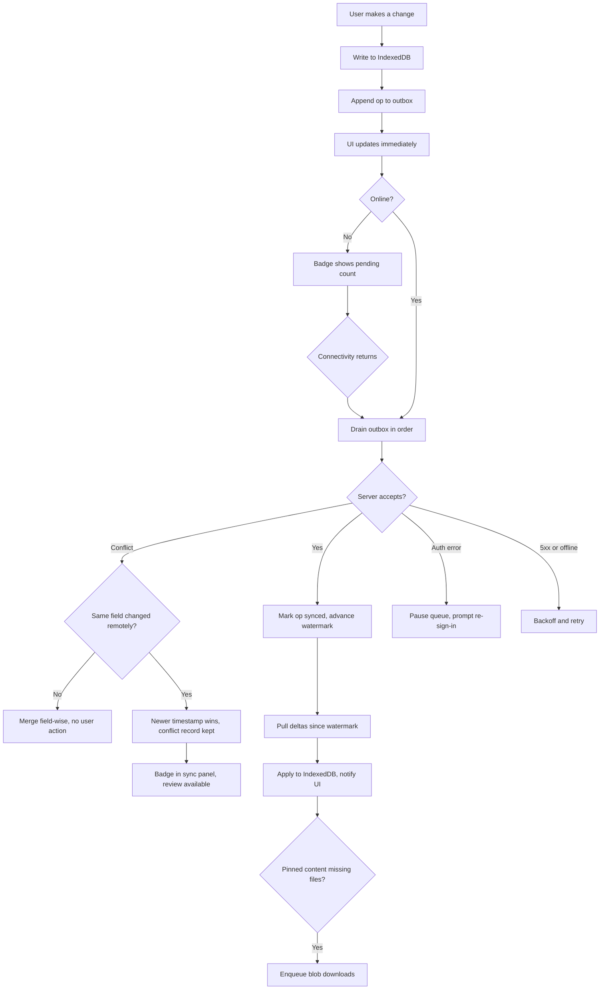
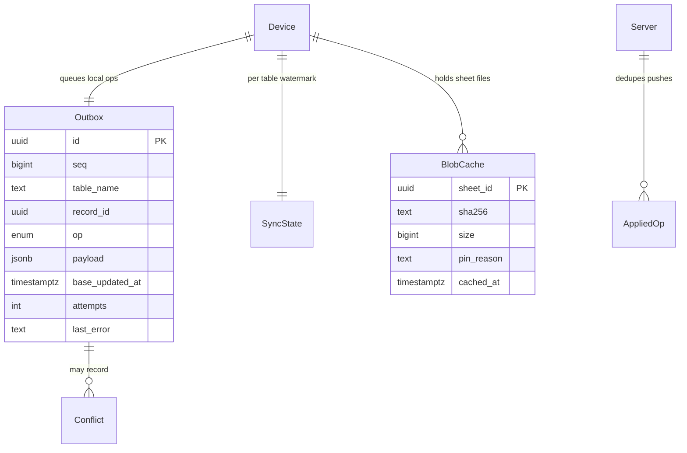

# Offline storage and sync engine

## Purpose

Venues have no wifi and phones have no signal behind a stone wall, but the band still has to
play. Every other feature in this system assumes it can read and write with the radio off; this
document specifies the machinery that makes that true — the local database, the change queue,
delta replication with Supabase, conflict resolution, and which files are kept on the device.

## Scope

- IndexedDB (Dexie) as the working source of truth for all metadata on each device.
- A durable outbox of local mutations, replayed to Supabase when connectivity returns.
- Delta pull per table using an `updated_at` watermark plus a server-assigned change sequence.
- Conflict resolution: last-writer-wins per field, with a per-record conflict record kept for
  30 days and surfaced in a review panel.
- Blob sync for sheet PDFs: a separate resumable queue with its own retry policy.
- Pin model — what is guaranteed offline, what is opportunistic, and how eviction works.
- Storage budget, usage display, and behaviour when the device refuses more storage.
- Sync status UI: online/offline, pending count, last successful sync, per-item errors.

**Not in scope**

- Real-time collaborative editing (CRDT/OT). Two people editing the same chart resolve by
  last-writer-wins per field; simultaneous editing is not a supported workflow.
- Live-session state sync — that is local-network only; see the presentation feature.
- Cross-workspace deduplication of identical PDFs.

## User journey

Every write lands locally first and the UI never waits for the network. The outbox drains in
order when a connection appears; a pull follows each successful drain so the device converges.
Conflicts are resolved automatically and reported afterwards rather than interrupting the
musician mid-service.

## Frontend

**Pages / views**

| View | Route | New or modified |
|---|---|---|
| Sync status panel | drawer from the header chip | New |
| Conflict review | `/settings/sync/conflicts` | New |
| Offline storage settings | `/settings/storage` | New |
| Trash (soft-deleted records) | `/settings/trash` | New |

**Entry points** — the connectivity chip in the app header (always visible); a toast when a
conflict is recorded; the storage warning when the budget is nearly full.

**States**

| State | Behaviour |
|---|---|
| Online, idle | Chip shows "synced" plus relative time of last successful sync |
| Online, syncing | Chip animates; panel lists operations in flight |
| Offline | Chip shows "offline" and the pending count; nothing is blocked |
| Error | Chip turns amber; panel names the failing operation, its record, and a retry action |
| Storage full | Blocking dialog only when a *pinned* download fails; opportunistic caching fails silently |

**Storage settings** show total used, a breakdown by workspace, the list of pinned sets and
folders, and a "download everything in this workspace" action with its size estimated first.

## Backend

**Local schema (Dexie)** — one store per synced table, plus:

| Store | Purpose |
|---|---|
| `outbox` | `{ id, seq, table, record_id, op, payload, base_updated_at, attempts, last_error, created_at }` |
| `sync_state` | per table: `{ table, watermark, last_pull_at, last_push_at }` |
| `conflicts` | `{ id, table, record_id, field, local_value, remote_value, resolved_with, at }` |
| `blobs` | `{ sheet_id, bytes, sha256, cached_at, pin_reason, size }` (OPFS where available) |
| `blob_queue` | `{ sheet_id, direction, attempts, bytes_done, last_error }` |

**Server endpoints**

| Method | Path | Handler | Permission |
|---|---|---|---|
| POST | `/functions/v1/sync-push` | batch upsert, returns per-op result | member, role-checked per table |
| GET | `/functions/v1/sync-pull?since=<seq>&tables=` | delta by change sequence | member |
| POST | `/storage/v1/object/sheets/...` | resumable upload | `editor`, `owner` |
| GET | `/storage/v1/object/sign/sheets/...` | signed URL, 1 h | member |

**Business rules**

1. All ids are client-generated UUIDv7, so an offline-created record never needs remapping and
   its creation time is embedded in the id.
2. The outbox is ordered and drained sequentially per workspace. An op that fails with a
   permanent error (403, 409-constraint, 422) is parked, not retried; transient errors retry
   with exponential backoff capped at 5 minutes.
3. Push is idempotent: each op carries a client op id, and the server records applied op ids for
   24 hours so a retried batch after a lost response is not applied twice.
4. Every synced table carries `updated_at` and a server-maintained `change_seq` (a bigint from a
   per-workspace sequence). Pull uses `change_seq`, not wall-clock time, so a device is immune
   to clock skew.
5. Conflict resolution is **per field, last-writer-wins by `updated_at`**, with the server's
   clock authoritative. Ties break by the higher `change_seq`. A record where a field lost is
   written to `conflicts` with both values.
6. Deletes are tombstones (`deleted_at`) and always win over concurrent edits. Tombstones purge
   after 30 days, both server and client.
7. Text fields that are long-form (`arrangements.body`, `songs.notes`, `annotations.strokes`)
   are conflict-detected on their whole value; when both sides changed, the loser's version is
   preserved verbatim in the conflict record so nothing is silently destroyed.
8. Blob sync is separate from metadata sync and never blocks it. A sheet row can exist without
   its file, and the UI states that plainly.
9. **Pin policy** — always kept offline: all metadata for every workspace the user belongs to;
   every chart body (text is small). Kept offline when pinned: sheet PDFs for pinned folders,
   pinned sets, and sets scheduled within 14 days. Opportunistic: any sheet the user has opened,
   kept under an LRU cap.
10. **Eviction** — only opportunistic blobs are evicted, LRU first, when the storage estimate
    passes 85% of the granted quota. Pinned blobs are never evicted; if a pinned download cannot
    fit, the user is told which pin to release.
11. `navigator.storage.persist()` is requested after the first pin, so the browser does not clear
    the origin under pressure. If it is denied, the storage settings page says so, because on
    iOS an unused origin can be evicted after 7 days.
12. Auth expiry pauses the queue rather than dropping ops. Nothing in the outbox is ever
    discarded without either a successful push or an explicit user action.

**Failure behaviour** — the app never blocks on sync. Errors accumulate in the panel with the
record, the operation and the server message. A parked op offers "retry", "discard my change" and
"keep mine and overwrite" as explicit choices.

**Asynchronous work** — the sync engine runs in a dedicated Web Worker with a `SharedWorker`
where supported so multiple open windows (presenter, stage) share one queue. Background Sync is
registered where available so a drain is attempted after the app is closed; iOS lacks it, so a
drain runs on every foreground.

**External calls** — Supabase only.

## Data storage

**Modified entities** — every synced table gains:

| Field | Type | Null | Notes |
|---|---|---|---|
| `updated_at` | timestamptz | no | set by a trigger on write, server clock |
| `change_seq` | bigint | no | from `workspace_change_seq` sequence, set by trigger |
| `deleted_at` | timestamptz | yes | tombstone |
| `updated_by` | uuid | yes | for the conflict panel's "changed by" |

**New entities (server)**

| Entity | Field | Type | Null | Notes |
|---|---|---|---|---|
| `applied_ops` | `op_id` | uuid | no | PK, client op id |
| | `user_id` | uuid | no | |
| | `applied_at` | timestamptz | no | purged after 24 h |
| `sync_conflicts` | `id` | uuid | no | PK; mirror of the local record, for cross-device review |
| | `workspace_id` | uuid | no | |
| | `table_name` | text | no | |
| | `record_id` | uuid | no | |
| | `field` | text | no | |
| | `losing_value` | jsonb | no | |
| | `losing_user` | uuid | yes | |
| | `at` | timestamptz | no | |

**Indexes** — server: `(workspace_id, change_seq)` on every synced table, which is the only index
the pull query needs; `applied_ops (applied_at)` for the purge job. Client: Dexie index on
`outbox.seq` and `blobs.cached_at`.

**Migration** — a shared `sync_columns` migration adds the four columns and the trigger to every
table; the sequence is per workspace, created with the workspace row.

## Acceptance criteria

1. With the network disabled for an hour, a user creates songs, edits charts, builds a set and
   annotates a cached sheet; on reconnect all of it appears on a second device with no data loss
   and no duplicate records.
2. Killing the app mid-sync and relaunching resumes the outbox from where it stopped, and no
   operation is applied twice (verified by unchanged record counts).
3. Two devices editing different fields of the same song offline both keep their change after
   sync; no conflict record is created.
4. Two devices editing the same chart body offline resolve to the later `updated_at`, and the
   losing body text is fully recoverable from the conflict review panel.
5. A record deleted on device A while edited on device B ends up deleted on both, and B's edit is
   visible in Trash for 30 days.
6. A set scheduled in 3 days downloads its sheets automatically; filling the device so the next
   pinned download fails produces a dialog naming which pin to release — and never evicts a
   pinned file to make room.
7. The sync chip shows "offline" within 2 seconds of losing connectivity, and the pending count
   matches the outbox length exactly.
8. With three windows open (library, presenter, stage), only one sync worker runs and the outbox
   is drained once, not three times.

## Open questions

- [ ] Should conflicts on `arrangements.body` offer a three-way merge view, or is
      "keep mine / keep theirs" enough for the first release?
- [ ] Is 14 days the right auto-pin horizon, and should past sets be unpinned automatically?
- [ ] Do we need an explicit "sync now" action, or is automatic drain sufficient?
- [ ] What is the behaviour when a user is removed from a workspace while they have unsynced
      changes in it? Currently: ops are parked and offered as an export.
