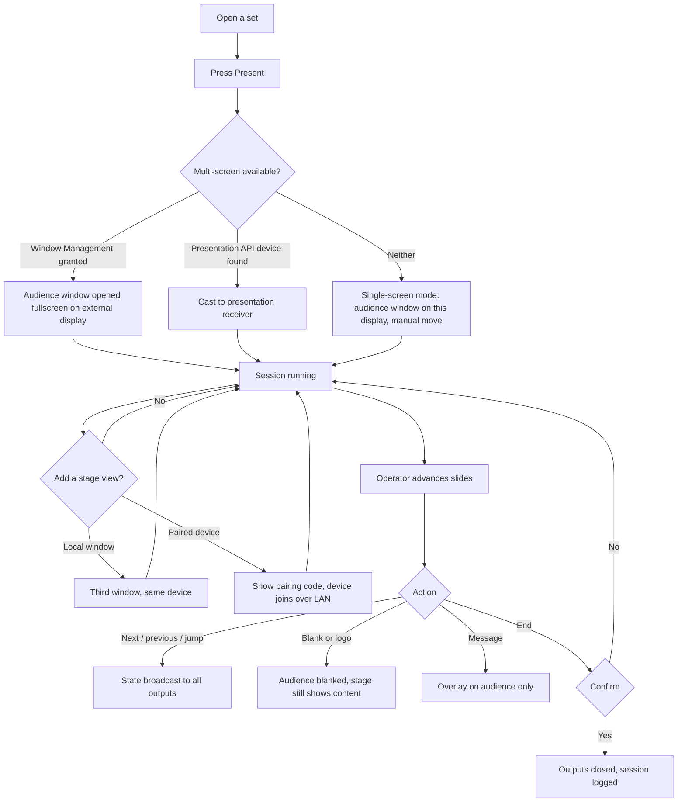
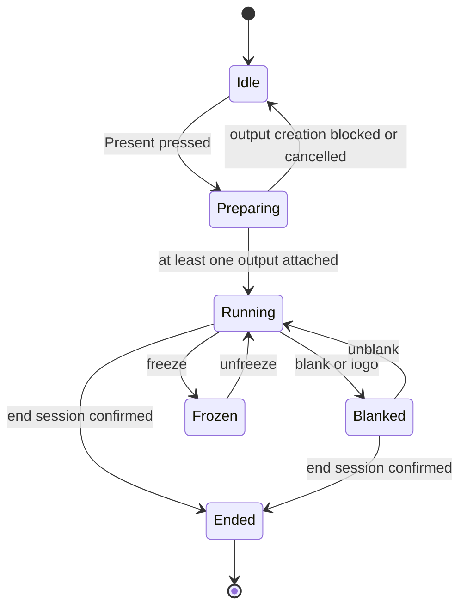
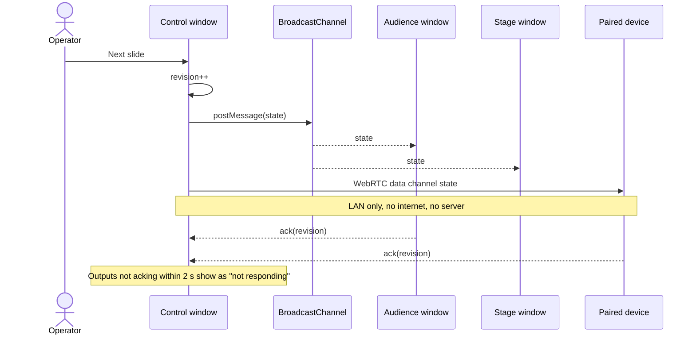
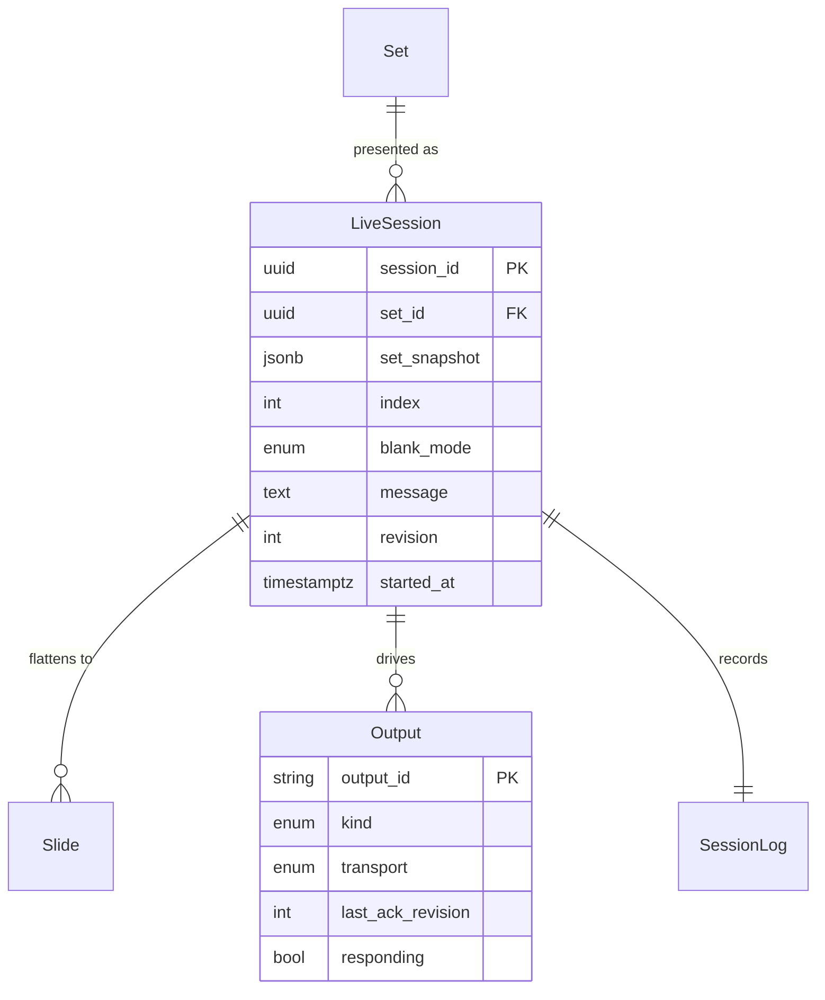

# Presentation — live sessions (parent)

This feature is split. This document owns the shared model — what a live session is, its state
machine, the control surface and the transport that carries state to every screen. The two child
documents own their layers:

- [Presenter output — audience screens](2026-09-06-presenter-output.md)
- [Stage view — local window and paired device](2026-09-06-stage-view.md)

## Purpose

During a service the operator needs lyrics on the wall, the band needs the current and next line
on a monitor, and both must keep working when the venue's wifi does not. Nothing in the library
today drives a second screen. This feature defines the live session: a running presentation of a
set, controlled from one device, mirrored to any number of local outputs.

## Scope

- Start a live session from a set (or from a single song, ad hoc).
- An immutable snapshot of the set taken at session start, so edits elsewhere cannot change what
  is on screen mid-service.
- A slide model derived from chart sections, non-song items and sheet pages.
- Control surface: current slide, next/previous, jump, blank/black/logo, freeze, and a live
  message overlay.
- One control device, many outputs: audience windows, stage windows, paired stage devices.
- A local-only transport — `BroadcastChannel` between windows on the same device, WebRTC over
  the LAN for paired devices — with no dependency on the internet.
- Session log: what was shown and when, kept locally for the last 20 sessions.

**Not in scope**

- Internet-relayed remote control (a session never leaves the local network).
- Video playback, camera input, NDI, lighting or ProPresenter interop.
- Editing songs during a session. The snapshot is read-only; edits are made before or after.
- Multi-operator control. Exactly one control surface owns a session.

## User journey

The operator presses Present on a set, the app opens an audience output on the best available
screen, and from then on every screen follows one state object. Blanking, freezing and messages
affect the audience without disturbing the stage, because the two outputs render the same state
with different rules.

## Shared model

**Session state** — one object, broadcast on every change:

| Field | Type | Meaning |
|---|---|---|
| `session_id` | uuid | identifies the session across windows and paired devices |
| `set_snapshot` | object | frozen copy of the set, its items and their effective keys |
| `slides` | array | flattened slide list built from the snapshot |
| `index` | int | current slide index |
| `blank_mode` | enum | `none` \| `black` \| `logo` \| `freeze` |
| `message` | text \| null | audience overlay text |
| `theme` | object | font, size, colour, background, safe margins |
| `started_at` | timestamp | |
| `revision` | int | monotonic; outputs ignore any state with a lower revision |

**State machine**

**Transport**

Same-device windows use `BroadcastChannel`, which needs no permission and no network. Paired
devices connect over the local network with WebRTC; signalling uses a short pairing code
exchanged out of band (displayed on the control screen, typed or QR-scanned on the device) and a
LAN-local signalling path — see the stage view document for the fallback when mDNS discovery is
unavailable.

## Data storage

Session state is **not** synced to the server: it is local and ephemeral by design, because a
session must run with no internet and has no meaning after it ends.

| Store | Location | Contents |
|---|---|---|
| `live_session` | in-memory + IndexedDB mirror | current state, written on every revision so a crashed control window can resume |
| `session_log` | IndexedDB, local only | `{ session_id, set_id, started_at, ended_at, slide_events[] }`, last 20 sessions |
| `presenter_prefs` | IndexedDB, per device | theme, default output display, stage view layout |

**Migration** — none server-side.

## Acceptance criteria

1. Pressing Present on a set with a projector attached opens a fullscreen audience window on the
   projector and leaves the control surface on the laptop screen.
2. Editing the set on another device during a running session does not change anything on screen;
   the change appears only after the session ends and the set is reopened.
3. Advancing a slide updates the audience window, the local stage window and a paired tablet
   within 150 ms on the same LAN, with the network's internet uplink physically disconnected.
4. Blanking the audience leaves the stage view showing the current and next slide.
5. Closing the control window by accident and reopening the app within 60 seconds offers to
   resume the session at the same slide.
6. An output that stops acking is shown as "not responding" in the control surface within 2
   seconds and does not stall the others.
7. Ending a session closes every output window, writes a session log entry, and releases the
   update hold from the PWA feature.

## Open questions

- [ ] Should a session be resumable after a full app restart, or only after a window crash?
- [ ] Do we need a hardware remote (Bluetooth page-turner / clicker) mapping in the first release?
- [ ] Should the session log be optional for privacy-conscious workspaces?
