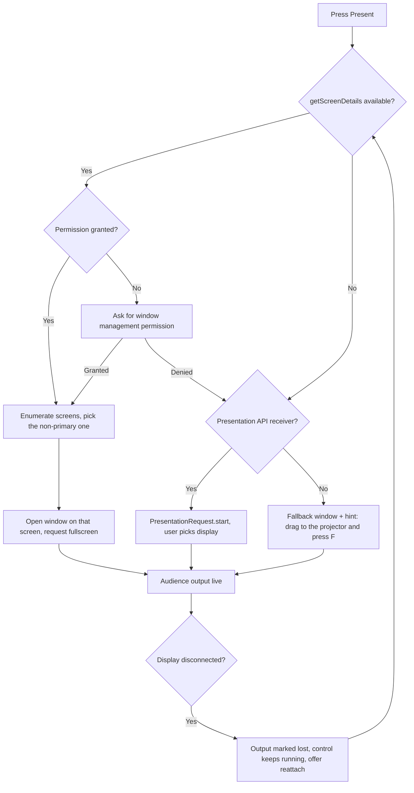
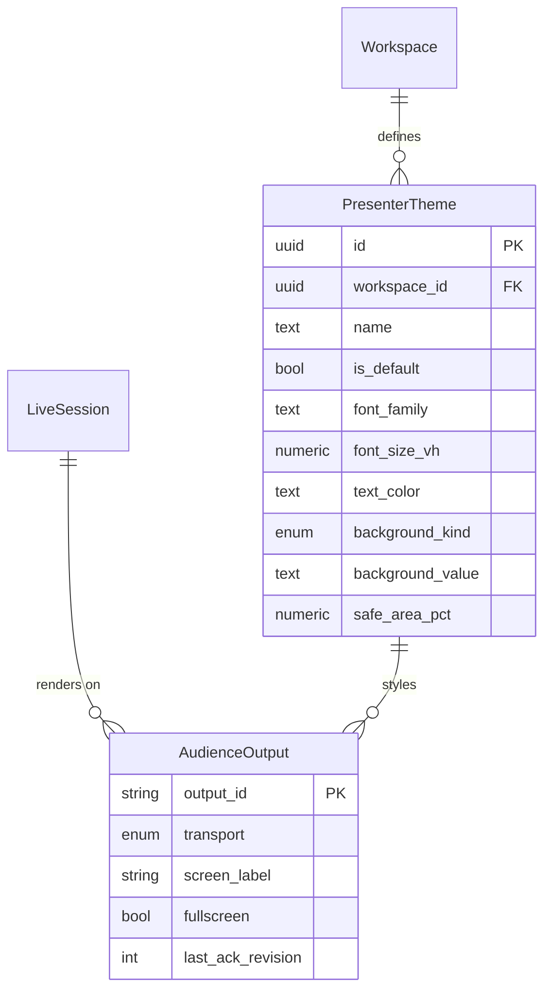

# Presenter output — audience screens

Child of [Presentation — live sessions](2026-09-06-presentation.md), which owns the session
model, state machine and transport. This document owns the audience-facing output: how it gets
onto the right display, how slides are built, and how it looks.

## Purpose

The congregation or audience needs lyrics large, legible and free of the operator's furniture.
Getting a browser window fullscreen on the second display, and keeping it there, is the part
every web-based presenter gets wrong.

## Scope

- Opening the audience output on an external display via the **Window Management API**
  (`getScreenDetails`, `fullscreen` on a chosen screen).
- **Presentation API** (`PresentationRequest`) as an alternative route for Cast-style and
  wireless displays, chosen automatically when a receiver is available.
- A manual fallback for browsers with neither: an audience window the user drags and fullscreens
  themselves, with an on-screen hint.
- Slide generation from chart sections, non-song items and sheet pages.
- Themes: font family and size, colour, alignment, background (colour, gradient or image),
  safe-area margins, drop shadow, and per-workspace defaults.
- Blank, black, logo and freeze; a text message overlay.
- Automatic reflow so a long section splits into readable slides instead of shrinking to nothing.
- Multiple simultaneous audience outputs (e.g. main screen and foyer screen) showing the same
  state.

**Not in scope**

- Video backgrounds, transitions beyond a cross-fade, or per-slide animation.
- Displaying chords to the audience (chords are stage and reader content only).
- Alpha-keyed output for a video mixer.

## User journey

The app tries the strongest mechanism first and degrades without ever failing to show something.
Once live, the audience window renders only from session state; it holds no logic of its own, so
a reload of that window recovers the current slide immediately.

## Frontend

**Pages / views**

| View | Route | New or modified |
|---|---|---|
| Control surface | `/present/:sessionId` | New |
| Audience output | `/output/audience?session=:id` | New |
| Output & display settings | `/present/:sessionId/displays` | New |
| Theme editor | drawer over the control surface | New |

**Entry points** — Present on a set or a song; reattach from the control surface after a display
is lost; the Presentation API receiver page when cast.

**States**

| State | Behaviour |
|---|---|
| Empty | Session with no slides (empty set): audience shows the logo slide, control explains |
| Loading | Audience window shows the theme background, never a spinner or a flash of white |
| Error | Output that cannot render a slide falls back to the previous slide and reports to control |
| Permission denied | Window Management denied: fall through to Presentation API or manual, with a settings link |
| Display lost | Audience window closed by the OS: control shows "output lost", session keeps running |

**Slide building rules** (client-side, deterministic):

1. A chart section becomes one or more slides: lyrics only, chords stripped, section label
   optional per theme.
2. A section is split when its rendered height exceeds the safe area at the theme's minimum font
   size; splits prefer blank lines, then sentence ends, then line ends. Never mid-line.
3. Repeat directives (`{chorus}` referring to an earlier section) expand into their own slides.
4. Non-song items become slides from their `content`; `blank` items become a black slide.
5. A `sheet` display item becomes one slide per PDF page, rendered by `pdf.js` at output
   resolution.
6. The slide list is rebuilt only at session start and when the theme's font metrics change,
   never on slide advance.

**Rendering** — the audience window uses `vh`-relative typography with a fitted-text pass, a
fixed safe-area inset (default 5%), and `will-change: opacity` cross-fades of 150 ms. It runs no
sync worker and holds no IndexedDB write path, so it cannot block on storage.

## Backend

None — the audience output is entirely local. Themes are the only persisted server-side data.

| Method | Path | Handler | Permission |
|---|---|---|---|
| GET/POST | `/rest/v1/presenter_themes` | upsert from sync queue | `editor`, `owner` |

**Business rules**

1. Themes are workspace-scoped and sync like any other record; a device may override the active
   theme locally for one session without changing the workspace default.
2. Background images are stored as sheets are — private storage, blob queue, cached offline.
   A theme whose background is not cached falls back to its background colour rather than white.
3. The output window is opened with `noopener` semantics but keeps a `BroadcastChannel`
   subscription; it never receives a direct object reference, so a crashed control window cannot
   corrupt it.
4. If the Presentation API is used, the receiver page is the same `/output/audience` route with a
   `PresentationConnection` transport instead of `BroadcastChannel`, chosen at runtime.

**Failure behaviour** — every failure degrades to a lower mechanism and reports in the control
surface. The audience never shows a browser error page: an uncaught render error paints the theme
background and re-requests the current state.

**Asynchronous work** — PDF page rasterisation for sheet slides, pre-rendered one slide ahead.

**External calls** — none.

## Data storage

**New entities**

| Entity | Field | Type | Null | Notes |
|---|---|---|---|---|
| `presenter_themes` | `id` | uuid | no | PK |
| | `workspace_id` | uuid | no | FK, cascade |
| | `name` | text | no | |
| | `is_default` | bool | no | one per workspace |
| | `font_family` | text | no | |
| | `font_size_vh` | numeric | no | max size; fitting may reduce it |
| | `text_color` | text | no | |
| | `background_kind` | enum | no | `color` \| `gradient` \| `image` |
| | `background_value` | text | no | colour, gradient spec, or storage path |
| | `align` | enum | no | `left` \| `center` |
| | `safe_area_pct` | numeric | no | default 5 |
| | `show_section_labels` | bool | no | default false |
| | `updated_at` | timestamptz | no | |

Local, per device: `presenter_prefs` gains `preferred_output_screen_id`, `last_transport`,
`fallback_hint_dismissed`.

**Indexes** — `presenter_themes (workspace_id)`; partial unique on `(workspace_id) where
is_default`.

**Migration** — one seeded default theme per workspace at creation: white text, black
background, centre aligned, 8vh.

## Acceptance criteria

1. On Chrome desktop with a projector attached and window management granted, pressing Present
   opens the audience window fullscreen on the projector without the operator touching it.
2. Denying the window management permission still produces a working audience window, with an
   on-screen hint explaining how to move it, and the control surface remains usable.
3. A chart section of 24 lines splits into readable slides at the theme's minimum font size, with
   no split occurring inside a line.
4. Unplugging the projector mid-session leaves the control surface running, marks the output
   lost, and reattaching the projector restores output at the same slide.
5. Two audience outputs (projector and foyer screen) show the same slide within one animation
   frame of each other.
6. Blanking to black paints a true black frame with no residual text visible during the fade.
7. A theme with an uncached background image renders on its background colour rather than white,
   with no console error visible to the audience.
8. Reloading the audience window mid-session recovers the current slide in under one second
   without operator action.

## Open questions

- [ ] Should the audience output be its own top-level route usable as a manual "second browser on
      another machine" output over the LAN, or is that the stage-view transport's job?
- [ ] Do we need per-song theme overrides, or is one theme per session enough?
- [ ] What is the minimum font size before we allow a split — a fixed vh, or a per-theme setting?
