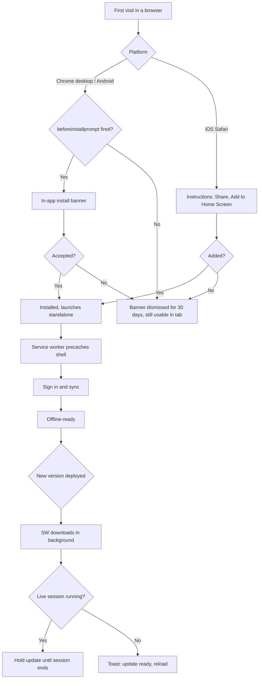
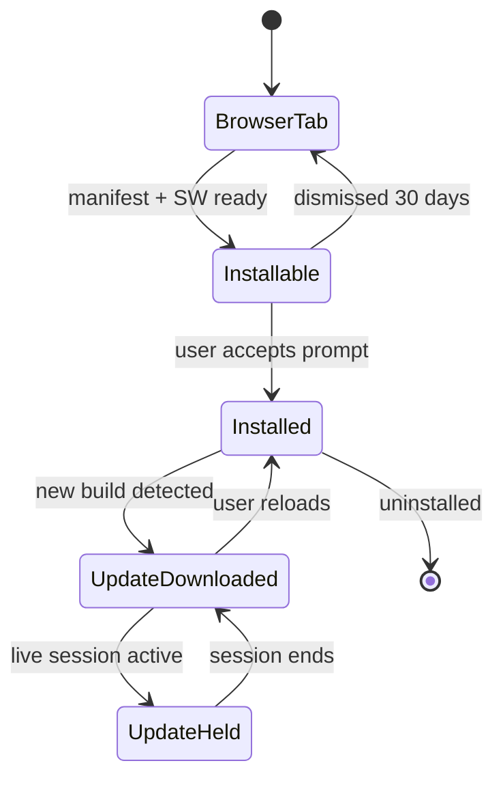

# PWA installation and offline app shell

## Purpose

The app has to launch from a home screen with no address bar and no network — on a laptop at a
venue, on an Android phone, and on an iPad whose owner will never install anything from an app
store. This feature specifies the manifest, the service worker, the per-platform install flows,
and how updates reach a device without interrupting a service.

## Scope

- Web app manifest with icons, name, theme, display mode and shortcuts.
- Workbox service worker: precached app shell, runtime caching rules, versioned updates.
- Install prompts: Chrome/Edge desktop and Android `beforeinstallprompt`, iOS Add-to-Home-Screen
  instructions, and a dismissible in-app banner.
- Update strategy: download in background, apply on next safe moment, never mid-presentation.
- File handling: open a `.pro`/`.chopro`/`.txt`/`.pdf` from the OS with Aurum Presenter, and
  accept shared files (Web Share Target) on Android.
- Launch shortcuts to Sets and to the last-used set.
- Cold start with no network reaching the library in under 2 seconds on a mid-range device.
- Wake-lock, fullscreen and orientation handling for stage use.

**Not in scope**

- App Store / Play Store distribution or a wrapper shell.
- Push notifications (nothing in the product needs them yet).
- Background Sync on iOS, which does not support it; a foreground drain covers it.

## User journey

The first visit works in a plain browser tab; installation is an upgrade, not a gate. Once
installed, the shell is precached and every later launch is offline-capable. Updates never apply
themselves while a presentation is running.

## Frontend

**Pages / views**

| View | Route | New or modified |
|---|---|---|
| Install banner | overlay on any route | New |
| iOS install instructions | modal | New |
| About / version | `/settings/about` | New |
| Update toast | overlay | New |

**Entry points** — automatic on the third visit or on the first pin action, whichever comes
first; a permanent "Install app" item in settings.

**States**

| State | Behaviour |
|---|---|
| Not installable | Banner hidden; settings shows why (already installed, or unsupported browser) |
| Installable | Banner with one-tap install |
| Installed | Banner hidden permanently; `display-mode: standalone` detected |
| Update available | Non-blocking toast with "reload now" and "later" |
| Update held | Silent while a live session runs; toast reappears afterwards |

**Manifest**

| Field | Value |
|---|---|
| `name` | Aurum Presenter |
| `short_name` | Aurum |
| `id` | `/` |
| `start_url` | `/library` |
| `display` | `standalone`, with `display_override: ["window-controls-overlay", "standalone"]` |
| `orientation` | `any` |
| `theme_color` / `background_color` | dark surface, matching the stage theme |
| `icons` | 192, 512, and 512 maskable PNG, plus a monochrome SVG |
| `shortcuts` | "Sets", "Last set", "New song" |
| `file_handlers` | `.pro`, `.chopro`, `.cho`, `.crd`, `.txt`, `.pdf` |
| `share_target` | POST `/share`, accepts files, Android only |
| `categories` | music, productivity |

## Backend

Static hosting plus the Supabase backend already specified. No new server endpoints.

**Service worker strategy**

| Resource | Strategy | Notes |
|---|---|---|
| App shell (JS, CSS, fonts, icons) | Precache, revisioned by build hash | Workbox `precacheAndRoute` |
| `index.html` | Network-first with 2 s timeout, cache fallback | So a new build is picked up quickly when online |
| Supabase REST | Never cached by the SW | IndexedDB is the cache; a stale HTTP cache would fight it |
| Supabase Storage (sheets) | Never cached by the SW | The blob queue owns file caching |
| Fonts, static images | Cache-first, 1 year | Immutable, hashed filenames |

**Business rules**

1. The service worker uses `skipWaiting: false`. A new worker waits until the app tells it to
   activate, so a reload never happens under a musician mid-song.
2. `registration.update()` is checked on foreground and every 30 minutes while online.
3. While a live session is active, updates are held; the app sets a flag the update controller
   reads, and clears it when the session ends.
4. A failed precache leaves the previous version installed and working. The app never ends up
   with a half-updated shell.
5. `navigator.storage.persist()` is requested at the first pin (see the sync feature), not on
   first load, so the prompt has an obvious reason behind it.
6. File handlers and the share target import through the same parser as the library's import
   dialog; a shared PDF opens the "attach to which song?" flow.
7. Wake lock is requested in reader mode, presenter and stage view, and released on exit or when
   the document is hidden; loss of the lock is re-requested on visibility change.
8. The build embeds a version string and build time, shown in About and included in error
   reports, so a support question can be answered without guessing.

**Failure behaviour** — if the service worker fails to register (private mode, unsupported
browser), the app still runs online-only and the storage settings page explains what is lost.

**Asynchronous work** — SW install and activate; periodic update check.

**External calls** — none beyond the already-specified Supabase.

## Data storage

**New entities** — none server-side.

Local: a `app_meta` store holding `{ installed_at, dismissed_install_banner_until,
sw_version, last_update_check, persist_granted }`.

**Indexes** — none.

**Migration** — none.

## Acceptance criteria

1. On Chrome desktop and Android, the install banner appears no earlier than the third visit and
   installs an app that launches standalone with no address bar.
2. On iOS 17 Safari, the instructions modal appears with the correct Share-menu wording, and the
   added home-screen app launches standalone.
3. With the device in airplane mode, launching the installed app reaches the library in under
   2 seconds and every synced song, chart and pinned sheet is readable.
4. Deploying a new build while the app is open shows the update toast without reloading; the app
   continues to work on the old version until the user reloads.
5. Deploying a new build while a live session is running produces no toast and no reload; the
   toast appears after the session ends.
6. Double-clicking a `.chopro` file on the desktop opens Aurum Presenter with the import dialog
   pre-filled.
7. Reader mode and presenter keep the screen awake for 10 minutes of inactivity on Android and
   iOS.
8. Registering the service worker in a private window fails gracefully: the app loads online-only
   and the storage page says offline use is unavailable.

## Open questions

- [ ] Should the install banner also appear on iOS after the first pin, given ATH is manual?
- [ ] Do we want window-controls-overlay on desktop, or a plain title bar for the first release?
- [ ] Is a 30-minute update check too aggressive for metered connections?
