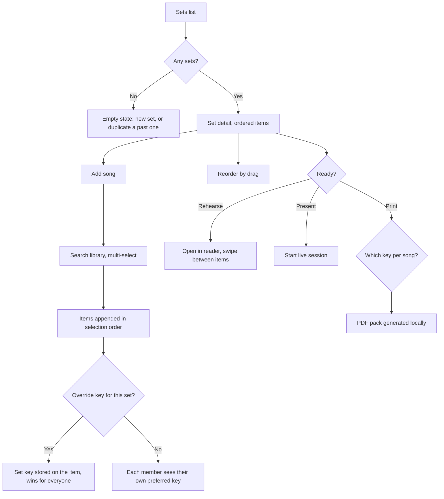
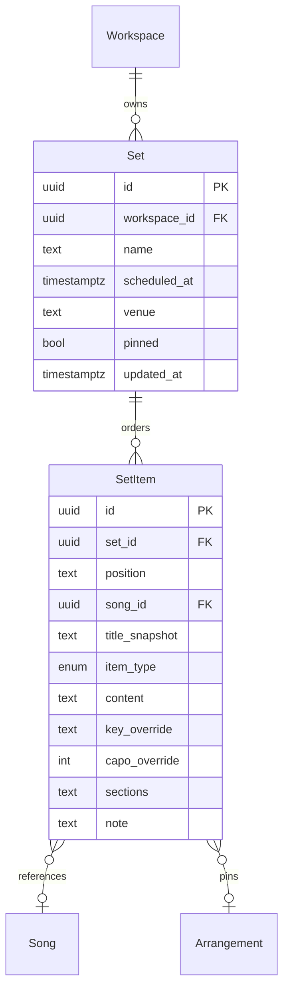

# Sets and setlists

## Purpose

A service or gig is an ordered run of songs with decisions attached: this one in G, that one
without the second verse, a scripture reading between them. Those decisions currently live in a
WhatsApp message and get lost. This feature defines the set — the unit a band rehearses from,
plays from, and presents from.

## Scope

- Create a set with a name, date, time and optional venue/service label.
- Add songs in order; drag to reorder; remove.
- Non-song items: announcement, scripture, prayer, video cue, blank/logo, free text — items that
  appear in the running order and in presentation but have no chart.
- Per-item overrides: key, capo, arrangement, sheet part, and a per-item note ("start at chorus").
- Per-item section selection: which chart sections are played, so the presenter and the printed
  view match the arrangement actually being used.
- Duplicate a set; use a past set as a template.
- Set-level assignment of members to the set (who is playing), used only for display.
- Sets are pinned for offline automatically when their date is within the next 14 days.
- Print / export a set as a PDF pack in each member's own key.

**Not in scope**

- Scheduling, availability polling and rostering. A set names who is playing; it does not ask.
- Calendar sync (candidate change request).
- Real-time set editing during a live session — a running session takes a snapshot; see the
  presentation feature.
- Rehearsal audio or metronome.

## User journey

A set is a list of items, each pointing at a song or carrying its own content. The set's key
override is a band-level decision and wins over every member's personal preference; without one,
each member reads their own key from the same set. Opening the set in reader mode gives a
swipeable run of the whole service, which is what most members use on stage.

## Frontend

**Pages / views**

| View | Route | New or modified |
|---|---|---|
| Sets list | `/sets` | New |
| Set detail / editor | `/sets/:setId` | New |
| Reader mode | `/sets/:setId/read/:index` | New |
| Add items picker | modal over set detail | New |
| Print/export dialog | modal | New |

**Entry points** — the Sets nav item; "add to set" from a song; a set link shared inside the
workspace; the presenter's start screen.

**States**

| State | Behaviour |
|---|---|
| Empty | "No sets yet" with new-set and duplicate-past-set actions |
| Loading | Renders from IndexedDB; item songs resolve locally, never over the network |
| Error | An item whose song was deleted renders as "missing song" with the stored title and a remove action |
| Permission denied | `viewer` sees the set and can read it; add, reorder, remove and override controls are hidden |
| Offline | Fully editable; changes queue for sync. Sheets not downloaded show the "not downloaded" panel from the sheets feature |

**Reader mode** — one item per screen, swipe or arrow keys to advance, a persistent header with
set name and position (`4 / 11`), and a jump-to-item sheet. Font size and notation layout come
from the user's chart display preferences. Screen-wake-lock is requested while reader mode is
open and released on exit.

**Validation** — set name required; date optional but warned about (offline pinning depends on
it); a song may appear more than once in a set (a reprise is legitimate).

## Backend

| Method | Path | Handler | Permission |
|---|---|---|---|
| GET | `/rest/v1/sets?workspace_id=eq.X&updated_at=gt.T` | delta pull | member |
| POST/PATCH | `/rest/v1/sets` | upsert from sync queue | `editor`, `owner` |
| GET | `/rest/v1/set_items?set_id=eq.X` | delta pull | member |
| POST/PATCH | `/rest/v1/set_items` | upsert from sync queue | `editor`, `owner` |

**Business rules**

1. Item ordering uses a fractional `position` (lexicographic rank string), so two people
   reordering offline produce a deterministic merge without renumbering every row.
2. An item references either a `song_id` or carries `item_type` + `content`; never both, and
   never neither. Enforced by a check constraint.
3. Deleting a song leaves its set items intact with a denormalised `title_snapshot`, so historic
   sets remain readable. The item renders as "missing song".
4. A set item's key override applies to everyone viewing that set. A member may still apply a
   one-off session key on top for themselves; it is not persisted.
5. Sets with a date in the next 14 days, and every set explicitly pinned, are included in the
   offline pin set: their charts, and their sheets for the effective keys, are downloaded.
6. Duplicating a set copies items and overrides, clears the date, and appends "(copy)".
7. Print generates the pack client-side with the sheet renderer + a print stylesheet: chart items are
   rendered at the chosen key, sheet items embed the source PDF pages. It works offline for any
   file already cached.
8. `assigned_members` is display-only and grants no permissions.

**Failure behaviour** — a print that hits an uncached sheet lists the missing sheets before
generating, and offers to continue without them. Local writes behave as in the library feature.

**Asynchronous work** — PDF pack generation runs in a Web Worker with a progress bar; pinning a
set enqueues its sheet downloads on the blob queue.

**External calls** — none.

## Data storage

**New entities**

| Entity | Field | Type | Null | Notes |
|---|---|---|---|---|
| `sets` | `id` | uuid | no | PK, UUIDv7 |
| | `workspace_id` | uuid | no | FK, cascade |
| | `name` | text | no | |
| | `scheduled_at` | timestamptz | yes | drives the 14-day auto-pin |
| | `venue` | text | yes | |
| | `notes` | text | yes | |
| | `assigned_members` | uuid[] | no | default `{}`, display only |
| | `pinned` | bool | no | default false, explicit offline pin |
| | `deleted_at` | timestamptz | yes | |
| | `updated_at` | timestamptz | no | |
| `set_items` | `id` | uuid | no | PK, UUIDv7 |
| | `set_id` | uuid | no | FK, cascade |
| | `workspace_id` | uuid | no | denormalised for RLS |
| | `position` | text | no | fractional rank string |
| | `song_id` | uuid | yes | FK; null for non-song items |
| | `title_snapshot` | text | yes | filled for song items, survives song deletion |
| | `item_type` | enum | yes | `announcement` \| `scripture` \| `prayer` \| `video` \| `blank` \| `text` |
| | `content` | text | yes | body for non-song items |
| | `key_override` | text | yes | wins over every member's preferred key |
| | `capo_override` | int | yes | |
| | `arrangement_id` | uuid | yes | FK |
| | `sheet_part_override` | enum | yes | |
| | `sections` | text[] | yes | ordered section ids actually played; null = all |
| | `note` | text | yes | e.g. "start at chorus" |
| | `deleted_at` | timestamptz | yes | |
| | `updated_at` | timestamptz | no | |

**Modified entities** — none.

**Indexes** — `sets (workspace_id, scheduled_at desc)`; `sets (workspace_id, updated_at)`;
`set_items (set_id, position)`; `set_items (workspace_id, updated_at)`;
`set_items (song_id)` for "which sets use this song".

**Check constraint** — `(song_id is not null) <> (item_type is not null)`.

**Migration** — initial, after songs and arrangements.

## Acceptance criteria

1. Adding five songs to a set and dragging the last to the top produces the same order on a
   second device after sync, with no renumbering conflict when both devices reordered offline.
2. A set item with `key_override = A` shows A to every member, including one whose preferred key
   for that song is C; removing the override returns each member to their own key.
3. A song deleted from the library leaves its set item readable with the original title and does
   not break the set.
4. A set dated within 14 days downloads its charts and the sheets for its effective keys without
   being pinned manually, and reader mode works with the network disabled.
5. Reader mode advances with the arrow keys on desktop and swipe on mobile, and keeps the screen
   awake for the duration.
6. Printing a 10-song set produces one PDF with each chart at that set's effective key and every
   cached sheet embedded, generated with the network disabled.
7. A `viewer` can open and read a set but cannot reorder it or change a key override.

## Open questions

- [ ] Should the 14-day auto-pin window be configurable per workspace?
- [ ] Do we need set templates as a first-class entity, or is "duplicate" enough?
- [ ] Should `sections` be validated against the arrangement's current sections, or kept loose
      so that editing a chart does not silently break historic sets?
