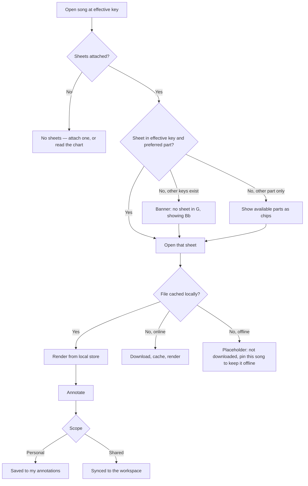
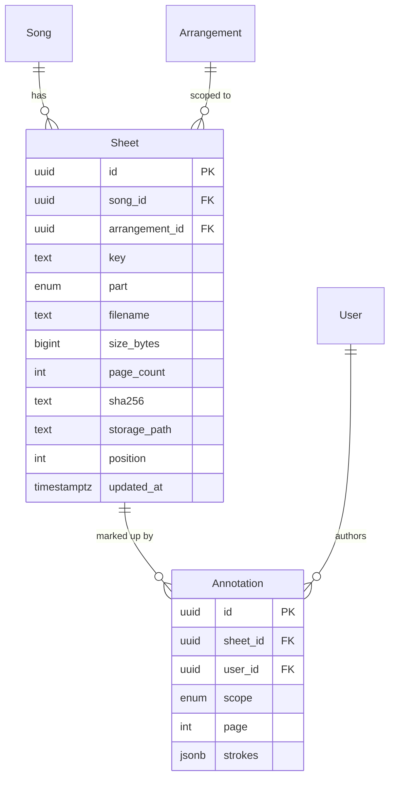

# Sheet attachments — PDFs per key

## Purpose

Chord charts do not cover everyone: the pianist reads a lead sheet, the string player reads
notation, and both need the version written in the key the band is playing. Today those PDFs sit
in a shared drive named `song_Bb_final_v2.pdf`. This feature attaches PDFs to a song, tags each
with its key and intended part, and picks the right one automatically when the key changes.

## Scope

- Attach one or more PDFs (and images, converted to a single-page PDF-like view) to a song.
- Tag each sheet with key, part (lead sheet, piano, vocal, guitar, lyrics, other), arrangement,
  and an optional label.
- Automatic selection: when a song is opened at an effective key, the sheet matching that key
  and the user's preferred part is shown first.
- A per-user preferred part, so a pianist always lands on the piano sheet.
- In-app PDF viewer: page navigation, zoom, fit-width/fit-page, rotate, two-page spread on
  tablets, and a half-page scroll optimised for reading while playing.
- Annotations: freehand and text notes drawn over a sheet, stored separately from the PDF and
  scoped per user or shared with the workspace.
- Replace a sheet's file while keeping its annotations and tags.
- Delete a sheet, with the same 30-day soft-delete window as songs.

**Not in scope**

- Extracting chords or lyrics from a PDF (no OCR in this release).
- Transposing a PDF. If no sheet exists for the requested key, the app says so and offers the
  nearest available key plus the transposed chart.
- Editing the PDF itself. Annotations are an overlay, never a rewrite of the file.
- Printing a set as a merged PDF (candidate change request).

## User journey

Opening a song evaluates the effective key from the chart feature and looks for a sheet with a
matching key and the user's preferred part. A missing key is a visible, explained fallback, never
a blank screen. Files render from the local store when present; a sheet that was never downloaded
is honest about it rather than spinning.

## Frontend

**Pages / views**

| View | Route | New or modified |
|---|---|---|
| Sheet viewer | `/song/:songId/sheet/:sheetId` | New |
| Sheet tab on song detail | `/song/:songId` tab | Modified (library feature) |
| Attach sheet dialog | modal | New |
| Sheet manager (list, tags, reorder) | drawer over song detail | New |
| Annotation toolbar | overlay in the viewer | New |

**Entry points** — the Sheets tab on a song; a set item whose display mode is "sheet"; drag a
PDF onto an open song.

**States**

| State | Behaviour |
|---|---|
| Empty | "No sheets for this song" with an attach button and a hint that the chart is available |
| Loading | First page renders as soon as it is decoded; remaining pages stream in |
| Error | A corrupt or password-protected PDF shows the failure and offers download of the raw file |
| Permission denied | `viewer` can read and make personal annotations; attach, replace, delete and shared annotations are hidden |
| Offline, not cached | Explicit "not downloaded" panel with the pin action and the file size |

**Validation** — accepted types `application/pdf`, `image/png`, `image/jpeg`, `image/heic`;
max 50 MB per file; key must be one of the 12 keys or `any`; part from the fixed enum. Files
over 10 MB warn about offline storage before upload.

**Mobile** — the viewer is full-bleed with tap zones for page turns; annotation uses touch and
Apple Pencil where available; two-page spread only above 900 px wide.

## Backend

| Method | Path | Handler | Permission |
|---|---|---|---|
| GET | `/rest/v1/sheets?song_id=eq.X` | delta pull | member |
| POST | `/rest/v1/sheets` | upsert from sync queue | `editor`, `owner` |
| PATCH | `/rest/v1/sheets?id=eq.X` | upsert from sync queue | `editor`, `owner` |
| POST | `/storage/v1/object/sheets/{workspace}/{sheet}` | Supabase Storage upload | `editor`, `owner` |
| GET | `/storage/v1/object/sign/sheets/...` | signed URL, 1 h | member |
| GET/POST | `/rest/v1/annotations` | upsert | own rows; shared rows need `editor` |

**Business rules**

1. A sheet row and its file are separate: the row syncs with the metadata delta, the file syncs
   through the blob queue. A row may exist locally with no file yet — that is the "not
   downloaded" state, not an error.
2. Storage path is `sheets/{workspace_id}/{sheet_id}.{ext}`; the object is private and only ever
   served through a signed URL or from the local cache.
3. Content hash (`sha256`) is stored on the row. A replace that produces the same hash is a
   no-op; a different hash invalidates every device's cached copy on next sync.
4. Sheet selection order: exact key + preferred part → exact key + any part → `any` key +
   preferred part → preferred part in the nearest key by circle-of-fifths distance → first sheet
   by `position`.
5. Capo does not affect sheet selection. A capo is a shape transform, and the sheet stays in the
   sounding key.
6. Deleting a song soft-deletes its sheets; the storage objects are purged by the same nightly
   job that purges songs, after the 30-day window.
7. Annotations reference `sheet_id`, `page`, and normalised coordinates (0–1 of page width and
   height), so they survive a zoom, a rotate, and a re-render at a different resolution. They do
   **not** survive a file replace whose page count differs — those are kept but flagged
   "may not line up".
8. Personal annotations are visible only to their author; shared annotations are visible to the
   workspace and editable by `editor` and `owner`.

**Failure behaviour** — an upload that fails is retried by the blob queue with backoff and shown
in the sync panel; the local file is kept until the upload succeeds, so nothing is lost. A signed
URL that expires mid-read is refreshed transparently once, then reported.

**Asynchronous work** — uploads and downloads run in the blob sync queue (see the sync feature),
chunked and resumable. Thumbnail generation for the sheet list runs client-side on first render
and is cached.

**External calls** — Supabase Storage only.

## Data storage

**New entities**

| Entity | Field | Type | Null | Notes |
|---|---|---|---|---|
| `sheets` | `id` | uuid | no | PK, UUIDv7 |
| | `song_id` | uuid | no | FK, cascade |
| | `workspace_id` | uuid | no | denormalised for RLS |
| | `arrangement_id` | uuid | yes | FK; null = applies to all arrangements |
| | `key` | text | yes | one of 12 keys, or null = `any` |
| | `part` | enum | no | `lead` \| `piano` \| `vocal` \| `guitar` \| `bass` \| `lyrics` \| `other` |
| | `label` | text | yes | free text, e.g. "SATB" |
| | `filename` | text | no | original filename, shown on download |
| | `mime_type` | text | no | |
| | `size_bytes` | bigint | no | |
| | `page_count` | int | yes | filled after first parse |
| | `sha256` | text | no | content hash |
| | `storage_path` | text | no | `sheets/{workspace}/{id}.{ext}` |
| | `position` | int | no | manual ordering within the song |
| | `deleted_at` | timestamptz | yes | |
| | `updated_at` | timestamptz | no | |
| `annotations` | `id` | uuid | no | PK |
| | `sheet_id` | uuid | no | FK, cascade |
| | `workspace_id` | uuid | no | |
| | `user_id` | uuid | no | author |
| | `scope` | enum | no | `personal` \| `shared` |
| | `page` | int | no | 1-based |
| | `strokes` | jsonb | no | normalised paths, text boxes, colour, width |
| | `updated_at` | timestamptz | no | |

Local-only: `sheet_files` object store keyed by `sheet_id`, holding the bytes (OPFS on
platforms that support it, an IndexedDB blob elsewhere) plus `cached_at` and `pinned_reason`.

**Indexes** — `sheets (song_id, position)`; `sheets (workspace_id, updated_at)` for delta pull;
`sheets (song_id, key, part)` for selection; `annotations (sheet_id, page)`;
`annotations (user_id, scope)`.

**Migration** — initial. A Storage bucket `sheets` with RLS policies mirroring workspace
membership, private by default, no public URLs.

## Acceptance criteria

1. A song with sheets in Bb and D, opened by a user whose preferred key is D and preferred part
   is piano, opens the D piano sheet without any interaction.
2. The same song opened at G shows the Bb sheet with a visible banner naming the substitution.
3. Setting capo 3 on a song sounding in D leaves the D sheet selected.
4. A 20 MB sheet attached while offline is readable immediately on that device and appears on a
   second device after both have synced.
5. An annotation drawn at 100% zoom appears at the same position on the page after rotating the
   sheet and reopening it at fit-width on a phone.
6. A `viewer` can draw a personal annotation but sees no attach, replace or delete control, and
   cannot see another user's personal annotations.
7. Replacing a sheet's file updates it on a second device on next sync without duplicating the
   sheet row, and keeps its key, part and shared annotations.
8. With the network disabled and the song not pinned, an uncached sheet shows the "not
   downloaded" panel with its size — never an infinite spinner.

## Open questions

- [ ] Should shared annotations be per arrangement as well as per sheet?
- [ ] Do we need a "print set" merged PDF in the first release?
- [ ] Should image attachments be converted to PDF on upload, or rendered natively?
- [ ] Is 50 MB the right per-file cap given iOS storage pressure?
