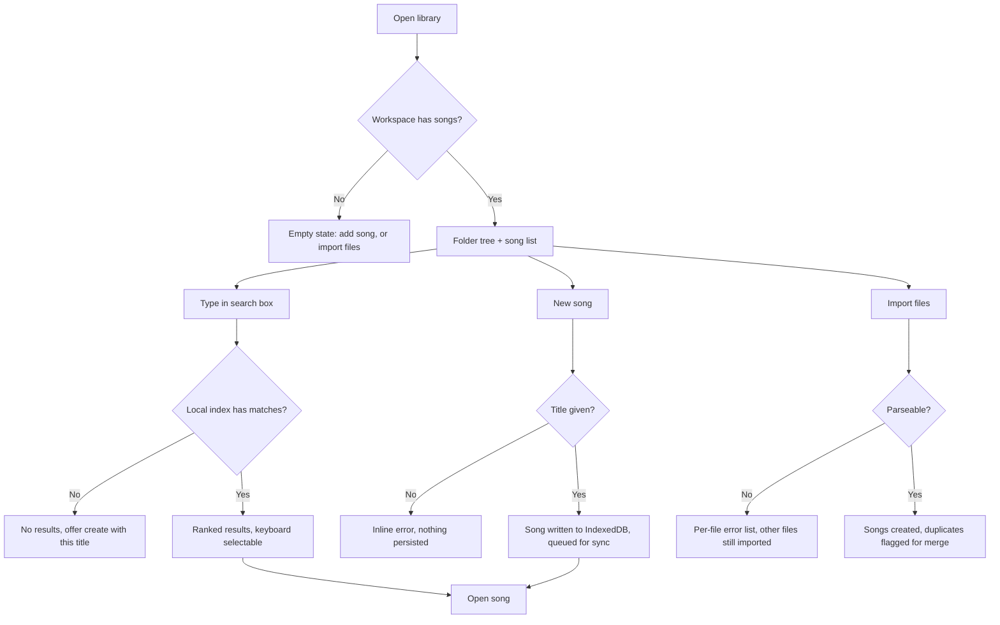
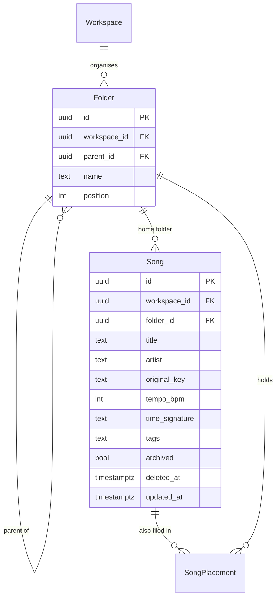

# Song library — folders, songs and search

## Purpose

A band accumulates hundreds of songs and needs to find one in seconds on a dark stage. Today
those songs live in a mix of paper binders, PDFs in cloud storage and a chord app that only one
member pays for. This feature defines the shared, offline library: a folder tree, the song
record everything else hangs off, and search that works with no network.

## Scope

- Folder tree of arbitrary depth within a workspace; drag to move; rename; delete with a
  confirmed cascade choice.
- Song records with title, alternate titles, artist, author, tempo, time signature, duration,
  original key, tags, CCLI number, notes.
- A song may appear in several folders (it has one home folder and any number of tag-like
  additional placements).
- Create, duplicate, move, archive and delete songs.
- Full-text search across title, alternate titles, artist, lyrics and tags, executed locally.
- Sort and filter by key, tempo, tag, last played, recently edited.
- Import from ChordPro files and plain chords-over-lyrics text files; export the same.

**Not in scope**

- Chart editing and transposition — see the chords feature.
- PDF handling — see the sheet attachments feature.
- Set building — see the sets feature.
- Automatic metadata lookup from an online song database.
- Song-level permissions; access is workspace-wide.

## User journey

The library opens to the folder tree on the left and the song list on the right, both rendered
from IndexedDB before any network call. Search filters as the user types against a local index,
so it is instant and works offline. Creating a song writes locally and enqueues a sync
operation; the song is usable immediately, with no spinner and no server round-trip.

## Frontend

**Pages / views**

| View | Route | New or modified |
|---|---|---|
| Library | `/library` | New |
| Folder contents | `/library/folder/:folderId` | New |
| Song detail | `/song/:songId` | New |
| Song metadata editor | drawer over song detail | New |
| Import | modal over library | New |
| Search results | inline over the song list | New |

**Entry points** — the app's default route after workspace selection; the global search
shortcut (`/` or `Cmd+K`) from anywhere; a song link from a set.

**States**

| State | Behaviour |
|---|---|
| Empty | Illustration plus two actions: "Add a song" and "Import ChordPro or text files" |
| Loading | List renders from IndexedDB synchronously; a thin sync bar appears only if a refresh is in flight |
| Error | A failed local write shows a toast with retry; sync failures never block the view |
| Permission denied | `viewer` sees the list read-only; new/edit/delete/move controls are hidden |
| Offline | Identical to online; the header shows an "offline" chip and pending-change count |

**Validation** — title required and trimmed, max 200 chars; tempo 20–300; duration as
`mm:ss`; CCLI numeric. Client-side for immediate feedback, re-checked at sync time by database
constraints. Duplicate titles are allowed but flagged with a "possible duplicate" hint.

**Mobile** — the folder tree collapses to a breadcrumb + sheet; the song list is the primary
surface; search is a full-screen overlay.

## Backend

Local writes go to IndexedDB; the sync engine (own feature) replicates them. Server-side rows
are PostgREST tables under workspace RLS.

| Method | Path | Handler | Permission |
|---|---|---|---|
| GET | `/rest/v1/songs?workspace_id=eq.X&updated_at=gt.T` | delta pull | member |
| POST | `/rest/v1/songs` | upsert from sync queue | `editor`, `owner` |
| PATCH | `/rest/v1/songs?id=eq.X` | upsert from sync queue | `editor`, `owner` |
| GET | `/rest/v1/folders?workspace_id=eq.X` | delta pull | member |
| POST | `/rest/v1/folders` | upsert | `editor`, `owner` |
| POST | `/rest/v1/song_placements` | upsert | `editor`, `owner` |

**Business rules**

1. A folder's parent must be in the same workspace, and a folder may not be moved into its own
   descendant. The client checks the path; a Postgres trigger re-checks and rejects cycles.
2. Deleting a folder asks the user to choose: move contained songs to the parent, or archive
   them. Songs are never hard-deleted by a folder delete.
3. Deleting a song is a soft delete (`deleted_at`), so the operation replicates to other
   devices and can be undone for 30 days. A nightly job purges rows past that window.
4. `archived` songs are excluded from search and lists unless the "show archived" filter is on.
5. Search is client-side only. The index covers title, alt titles, artist, tags and the plain
   text extracted from the chart, and is rebuilt incrementally on every song write.
6. Import parses ChordPro directives (`{title:}`, `{artist:}`, `{key:}`, `{tempo:}`) and,
   for plain-text files, infers the title from the filename and the key from the first chord.
   Files that fail to parse are reported per file; a partial import is never rolled back.
7. Song ids are client-generated UUIDv7, so an offline-created song keeps its identity forever.

**Failure behaviour** — user-visible errors only for local write failures (quota, corrupt
store). Sync errors surface in the sync status panel, not as modal errors over the library.

**Asynchronous work** — search index rebuild runs in a Web Worker, debounced 250 ms. Import
of more than 20 files is chunked so the UI never blocks.

**External calls** — none.

## Data storage

**New entities**

| Entity | Field | Type | Null | Notes |
|---|---|---|---|---|
| `folders` | `id` | uuid | no | PK, UUIDv7 client-generated |
| | `workspace_id` | uuid | no | FK, cascade |
| | `parent_id` | uuid | yes | FK self; null = root |
| | `name` | text | no | unique per parent, case-insensitive |
| | `position` | int | no | manual ordering among siblings |
| | `deleted_at` | timestamptz | yes | soft delete |
| | `updated_at` | timestamptz | no | sync watermark |
| `songs` | `id` | uuid | no | PK, UUIDv7 |
| | `workspace_id` | uuid | no | FK, cascade |
| | `folder_id` | uuid | yes | home folder; null = unfiled |
| | `title` | text | no | |
| | `alt_titles` | text[] | no | default `{}` |
| | `artist` | text | yes | |
| | `author` | text | yes | |
| | `ccli` | text | yes | |
| | `original_key` | text | yes | e.g. `Bb`, `F#m` |
| | `tempo_bpm` | int | yes | 20–300 |
| | `time_signature` | text | yes | e.g. `4/4`, `6/8` |
| | `duration_sec` | int | yes | |
| | `tags` | text[] | no | default `{}` |
| | `notes` | text | yes | free text, not presented |
| | `archived` | bool | no | default false |
| | `deleted_at` | timestamptz | yes | |
| | `updated_at` | timestamptz | no | |
| `song_placements` | `song_id` + `folder_id` | uuid | no | composite PK; extra folders a song appears in |

**Modified entities** — none.

**Indexes** — `songs (workspace_id, updated_at)` for delta pull; `songs (workspace_id,
folder_id)`; GIN on `songs (tags)`; `folders (workspace_id, parent_id, position)`;
`folders (parent_id, lower(name))` unique. Client-side: Dexie compound index on
`[workspace_id+folder_id]` and a separate inverted index table for search terms.

**Migration** — initial schema, created with the workspaces migration.

## Acceptance criteria

1. With the network disabled, a user can create a song, move it between folders, and find it by
   typing three letters of its title; all three survive an app restart.
2. Searching a 1,000-song library returns ranked results in under 100 ms on a mid-range phone.
3. Dragging a folder onto one of its own descendants is refused with an explanatory message and
   leaves the tree unchanged.
4. Deleting a folder containing 12 songs prompts for a choice; picking "move to parent" leaves
   all 12 songs reachable and none archived.
5. Importing a folder of 30 ChordPro files where 2 are malformed creates 28 songs and lists the
   2 failures with their filenames and the parse error.
6. A `viewer` sees no "New song" button and cannot rename a folder.
7. A song deleted on one device disappears from the library on a second device after that
   device syncs, and is restorable from Trash within 30 days on either.

## Open questions

- [ ] Should a song's home folder be mandatory, or is "unfiled" an acceptable permanent state?
- [ ] Do tags need a managed vocabulary per workspace, or is free text enough?
- [ ] Should search cover the notes field? It may contain private cues not meant to surface.
