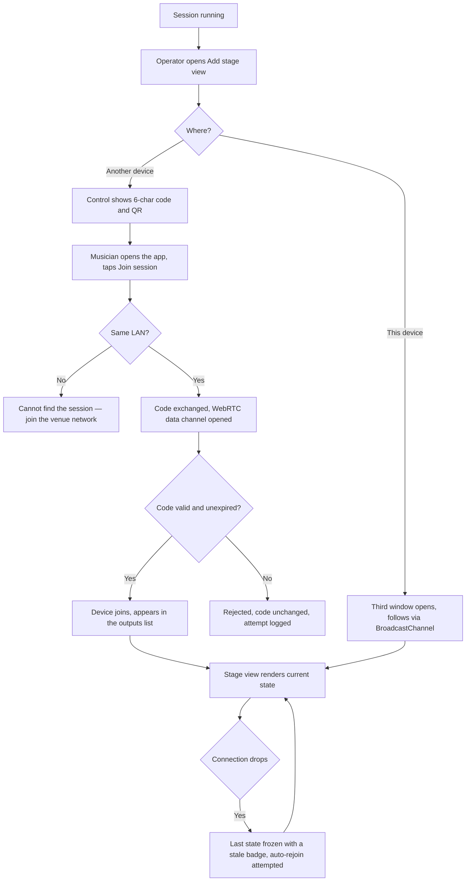
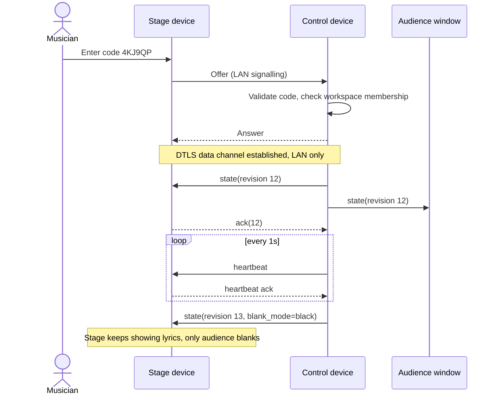

# Stage view — local window and paired device

Child of [Presentation — live sessions](2026-09-06-presentation.md), which owns the session
model, state machine and transport. This document owns the musician-facing output: what it shows,
and how a phone or tablet joins a session over the local network with no internet.

## Purpose

The band cannot read the audience screen: they need the current section with chords in their own
key, the next line, the running order and a clock. On a laptop that is a third window; on stage it
is usually a tablet on a music stand. Both must follow the same session with no internet.

## Scope

- A stage view window on the control device, opened next to the audience output.
- A paired stage view on a separate device on the same LAN — phone, tablet or spare laptop.
- Pairing by 6-character code shown on the control surface, with a QR code as a shortcut.
- Content: current slide with chords at the viewer's own key, next slide preview, section label,
  set position, next song title, elapsed and section clocks, and the operator's stage messages.
- Per-device layout: font size, chords on/off, next-line preview on/off, clock style, and a
  high-contrast dark theme for dark stages.
- Stage messages sent from the control surface to stage views only ("2 more times", "wrap up").
- Read-only by default; an optional "allow this device to advance slides" grant per pairing.

**Not in scope**

- Pairing over the internet or through the sync backend. A stage device that is not on the same
  network cannot join.
- Editing songs or sets from a stage device during a session.
- More than one device controlling the session at a time.

## User journey

A stage view is a subscriber to the same session state as the audience, rendered with different
rules: it keeps chords, shows what is coming, and never blanks when the audience does. A paired
device joins by code over the LAN, and when the connection drops it holds the last known slide —
visibly marked stale — rather than going blank in front of a congregation.

## Frontend

**Pages / views**

| View | Route | New or modified |
|---|---|---|
| Stage view | `/output/stage?session=:id` | New |
| Join session | `/join` | New |
| Pairing panel | drawer on the control surface | New |
| Stage layout settings | sheet within stage view | New |

**Entry points** — "Add stage view" on the control surface; "Join session" on the library home of
any device in the same workspace; a scanned QR code that deep-links to `/join?code=XXXXXX`.

**States**

| State | Behaviour |
|---|---|
| Empty | Joined but the session has not started: shows set name and "waiting for the first slide" |
| Loading | Renders the last cached state instantly, then updates on the first message |
| Error | Pairing failure explains whether the code was wrong, expired, or the network is different |
| Permission denied | A workspace `viewer` may join a stage view; only the operator's device controls |
| Stale | Connection lost: last slide stays on screen, dimmed border and a "reconnecting" chip |

**Layout** — a single column on a phone, two columns on a tablet: current section large on the
left, next section smaller on the right, a persistent footer with set position, elapsed time and
the next song. Every element is optional per device. The theme is dark by default with an
adjustable brightness floor, because stage views sit in a musician's eye line.

**Validation** — join codes are 6 characters from an unambiguous alphabet (no `0/O`, `1/I`),
case-insensitive, valid for 30 minutes, single active code per session.

## Backend

No server involvement in the session itself. Signalling is LAN-local.

**Transport and pairing rules**

1. Same-device windows use `BroadcastChannel` and require no pairing.
2. A paired device uses a WebRTC `RTCDataChannel`. Signalling runs over the LAN:
   - the control device advertises over mDNS/DNS-SD (`_aurumpresent._tcp`) where the platform
     allows it, and the joining device resolves the code to a host;
   - where mDNS is unavailable (common in browsers), the control device runs a
     `WebTransport`-less fallback: the joining device posts its offer to the control device's
     local HTTP endpoint discovered from a QR code that embeds host and port;
   - if neither path is available and the workspace is online, signalling falls back to a
     Supabase Realtime channel scoped to the session id, used **only** to exchange SDP — the
     media/data path stays on the LAN.
3. The pairing code is a shared secret for the session: the data channel is DTLS-encrypted, and
   the code is used to derive the channel name and to authorise the join.
4. A joining device must be signed into the same workspace. Session state includes copyrighted
   lyrics, so an unauthenticated join is refused even with a valid code.
5. State messages are the session state object; each carries `revision`, and a stage view ignores
   any message whose revision is lower than the last applied one.
6. Heartbeat every 1 second; three missed heartbeats mark the connection stale. Rejoin is
   attempted with backoff for 5 minutes.
7. A stage device renders chords at **its own user's** effective key unless the set item carries a
   key override, which wins for everyone (per the sets feature).
8. "Allow advance" is granted per paired device, revocable at any time from the control surface,
   and never enabled by default. Only one device may hold it at a time.

**Failure behaviour** — a failed join never affects the running session. A stale stage view keeps
displaying content; it never blanks, never shows a browser error, and never steals focus.

**Asynchronous work** — heartbeat and reconnect loops; QR code generated client-side.

**External calls** — Supabase Realtime only as the last-resort signalling fallback, and never for
state transport.

## Data storage

No new server tables. Local, per device:

| Store | Contents |
|---|---|
| `stage_prefs` | font size, chords on/off, next preview on/off, clock style, brightness floor |
| `session_peers` | on the control device: `{ output_id, kind, label, joined_at, can_advance, last_ack_revision, responding }` |
| `last_session_state` | on a stage device: the last applied state, so a reopen renders instantly |

**Indexes** — none.

**Migration** — none.

## Acceptance criteria

1. With the venue router's internet uplink unplugged, a tablet on the same wifi joins a session
   by 6-character code and shows the current slide within 3 seconds.
2. Advancing a slide on the control device updates a paired tablet within 150 ms on the same LAN.
3. Blanking the audience to black leaves every stage view showing the current and next section.
4. A stage view shows chords in its own user's preferred key; adding a set-item key override
   changes every stage view to that key.
5. Pulling the tablet's wifi freezes the last slide with a visible stale indicator and no blank
   screen; restoring wifi rejoins automatically and catches up to the current slide.
6. A device signed into a different workspace that enters a valid code is refused with an
   explanatory message, and the code keeps working for legitimate devices.
7. Granting "allow advance" to one paired device lets it move the session; granting it to a
   second device revokes it from the first.
8. An expired code (over 30 minutes old) is refused, and the control surface can issue a new one
   without disturbing already-joined devices.

## Open questions

- [ ] Is the Supabase Realtime signalling fallback acceptable, or must pairing be strictly
      offline even at the cost of failing on locked-down networks?
- [ ] Should a stage device be able to run without an account when the workspace is a personal
      one — e.g. the user's own second device?
- [ ] Do we need a countdown/timer feature (pre-service countdown) in stage view, or is elapsed
      time enough for the first release?
- [ ] Should stage views be able to scroll ahead independently without leaving the session?
