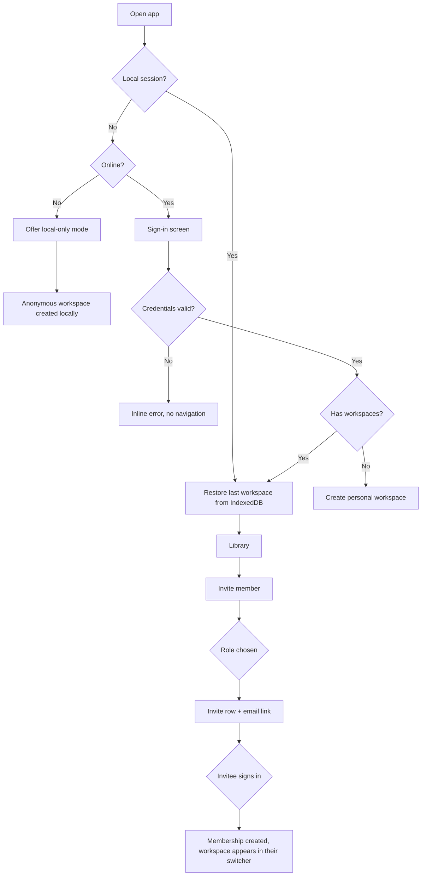
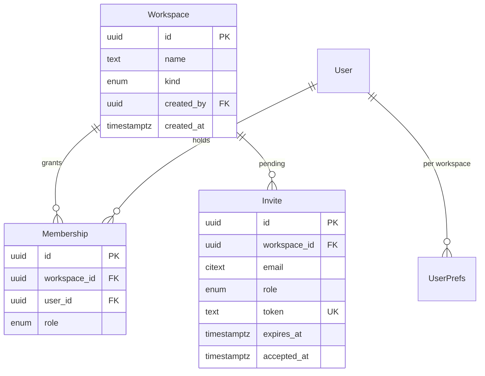

# Accounts, workspaces and access control

## Purpose

A band shares one library, but each musician plays in their own key and on their own device.
Without an account and a shared workspace there is no way to put a song in front of the whole
band, and no way to keep one member's preferred key from overwriting another's. This feature
defines sign-in, the workspace boundary that every other record hangs off, and the three roles.

## Scope

- Email + password and OAuth (Google, Apple) sign-in via Supabase Auth.
- A personal workspace created automatically on first sign-in.
- Additional band workspaces; invite by email link; owner / editor / viewer roles.
- Workspace switching, including while offline.
- Anonymous local-only mode: use the app fully offline with no account, upgrade later without
  losing data.
- Sign-out that is explicit about what local data is removed.

**Not in scope**

- Per-folder or per-song permissions. The workspace is the only permission boundary.
- SSO/SAML, org directories, seat billing.
- Public or link-based sharing outside a workspace.
- Transferring individual songs between workspaces (a later change request; copy-on-write is
  the likely design).

## User journey

A returning user lands straight in their last workspace from local data — the session is
restored before any network call, so a cold start on a plane reaches the library. A new user
either signs in or takes local-only mode; local-only data is migrated into the personal
workspace on the first successful sign-in, keeping the same record ids so nothing re-downloads.
An owner invites a bandmate by email with a chosen role; the invite becomes a membership when
the invitee signs in with that address.

## Frontend

**Pages / views**

| View | Route | New or modified |
|---|---|---|
| Sign in / sign up | `/auth` | New |
| Workspace switcher | overlay, any route | New |
| Members | `/settings/members` | New |
| Invite accept | `/invite/:token` | New |
| Account settings | `/settings/account` | New |

**Entry points** — cold start when no session exists; the avatar menu in the app header;
an invite link in email.

**States**

| State | Behaviour |
|---|---|
| Empty | No workspaces (impossible after first sign-in — a personal one is always created) |
| Loading | App shell renders immediately from cache; workspace list hydrates from IndexedDB, then refreshes from the server |
| Error | Sign-in errors inline under the field; network failure during sign-in offers local-only mode |
| Permission denied | Members page is read-only for editor and viewer; invite and role controls are hidden, not disabled |
| Offline | Workspace switching works across any workspace already synced; invites and role changes are queued and marked "will send when online" |

**Validation** — email format and password length client-side; the server re-checks both, plus
invite token validity, expiry and single use.

## Backend

Supabase-hosted; "endpoint" means a PostgREST table with RLS or an Edge Function.

| Method | Path | Handler | Permission |
|---|---|---|---|
| POST | `/auth/v1/token` | Supabase Auth | public |
| GET | `/rest/v1/workspaces` | RLS select | member of workspace |
| POST | `/rest/v1/workspaces` | RLS insert | any authenticated user |
| GET | `/rest/v1/memberships?workspace_id=eq.X` | RLS select | member |
| POST | `/functions/v1/invite` | `invite` Edge Function | `owner` |
| POST | `/functions/v1/invite-accept` | `invite-accept` Edge Function | authenticated, token valid |
| PATCH | `/rest/v1/memberships` | RLS update | `owner` |
| POST | `/functions/v1/claim-local-workspace` | `claim-local-workspace` | authenticated |

**Business rules**

1. Every user has exactly one `personal` workspace, created on first sign-in and not deletable.
2. A workspace always has at least one `owner`. Demoting or removing the last owner is refused.
3. An invite is single-use, expires after 14 days, and binds to the email it was sent to.
4. Accepting an invite for an email that differs from the signed-in account is refused.
5. Removing a member deletes their membership and their per-user preferences for that
   workspace; it never deletes shared content they created.
6. RLS is the enforcement point: no table in this system is readable without a matching
   membership row, and role is read from that row, never from a client claim.
7. Local-only mode uses a client-generated workspace UUID. On claim, the same UUID is inserted
   server-side so local record ids stay valid and no re-download occurs.
8. Sign-out clears the auth token and per-user preferences but keeps synced content in
   IndexedDB unless the user checks "also remove downloaded songs from this device".

**Failure behaviour** — auth failures show inline and are never queued. A failed invite send is
retried by the sync queue up to 5 times with backoff, then surfaced in Members as "not sent".
RLS denials are logged with workspace and user id and shown as "you no longer have access to
this workspace", followed by a switch to the personal workspace.

**Asynchronous work** — invite emails are sent by the Edge Function via Supabase's mailer.
A nightly job deletes invites older than 30 days.

**External calls** — Google and Apple OAuth through Supabase Auth. When unavailable, email
sign-in and local-only mode both remain available; the OAuth buttons show a disabled state.

## Data storage

**New entities**

| Entity | Field | Type | Null | Notes |
|---|---|---|---|---|
| `workspaces` | `id` | uuid | no | PK, may be client-generated |
| | `name` | text | no | |
| | `kind` | enum | no | `personal` \| `band` |
| | `created_by` | uuid | yes | FK `auth.users`, null while local-only |
| | `created_at` | timestamptz | no | default `now()` |
| `memberships` | `id` | uuid | no | PK |
| | `workspace_id` | uuid | no | FK, cascade delete |
| | `user_id` | uuid | no | FK `auth.users`, cascade delete |
| | `role` | enum | no | `owner` \| `editor` \| `viewer` |
| | `created_at` | timestamptz | no | |
| `invites` | `id` | uuid | no | PK |
| | `workspace_id` | uuid | no | FK, cascade delete |
| | `email` | citext | no | |
| | `role` | enum | no | role granted on accept |
| | `token` | text | no | unique, 32 bytes base64url |
| | `expires_at` | timestamptz | no | created_at + 14 days |
| | `accepted_at` | timestamptz | yes | null while pending |
| `user_prefs` | `user_id` + `workspace_id` | uuid | no | composite PK |
| | `prefs` | jsonb | no | UI prefs; per-song keys live on `song_prefs` |

**Modified entities** — none; this is the first feature.

**Indexes** — `memberships (user_id, workspace_id)` unique; `memberships (workspace_id)`;
`invites (token)` unique; `invites (workspace_id, email)` partial where `accepted_at is null`.

**Migration** — initial schema. RLS enabled on every table with a policy joining through
`memberships`. A `current_role(workspace uuid)` SQL helper keeps the policies readable.

## Acceptance criteria

1. A first-time user who signs in gets exactly one workspace named "My songs" with role `owner`.
2. With the network disabled, launching the installed app reaches the library of the last-used
   workspace without a sign-in screen.
3. A user with no account can create songs offline, then sign in, and those songs appear in
   their personal workspace with no duplicates and no re-download.
4. An `editor` sees no invite button and no role dropdown on the Members page; a direct PATCH
   to `memberships` from that account is refused by RLS.
5. An owner who is the only owner cannot demote themselves; the attempt shows an explanatory
   error and leaves the role unchanged.
6. An invite link opened by a signed-in user whose email differs from the invited address shows
   "this invite is for someone else" and creates no membership.
7. A member removed from a band workspace stops seeing it in the switcher on their next sync,
   and their pinned PDFs from that workspace are deleted from the device.

## Open questions

- [ ] Should a `viewer` be allowed to run a live session, or is that an `editor` capability?
      Currently specified as allowed.
- [ ] Do we need a "leave workspace" action distinct from being removed?
- [ ] Is there a cap on band workspace size for the first release?
