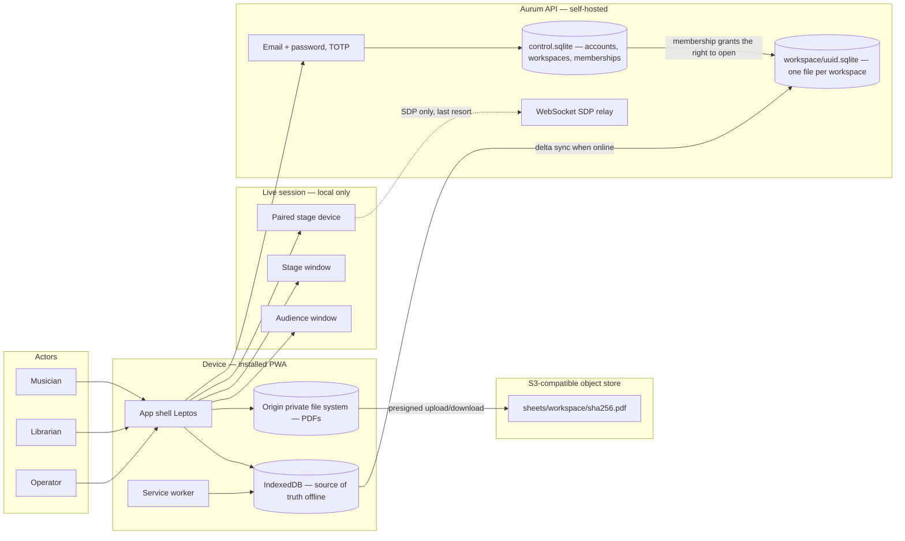
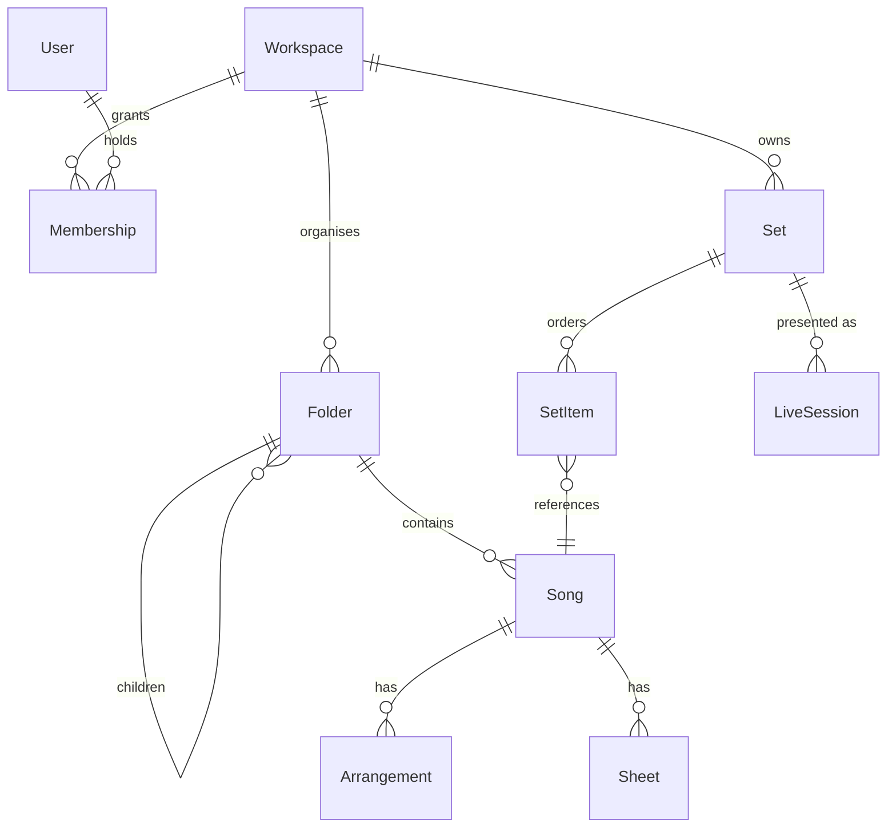

# System overview

Shared context for every feature specification. Deliberately coarse — detail belongs in
feature documents, and an overview that tries to be complete goes stale within a week.

## Purpose

Aurum Presenter is an installable, offline-first web app for worship and gigging musicians who
manage chord charts, sheet music and lyrics. It keeps a band's song library on every device
without a network, transposes charts to any key on demand, and drives a multi-screen live
presentation — audience output plus a stage view — from the same set.

## Actors

| Actor | Description | Kind |
|---|---|---|
| Musician | Reads charts, transposes to their key, plays from a set. Default role. | Human |
| Librarian | Owner or editor of a workspace: adds songs, uploads sheets, curates folders and sets. | Human |
| Operator | Runs a live session: drives the audience screen and stage view during a service or gig. | Human |
| Sync service | The Aurum API: Rust and axum over SQLite, one database file per workspace. Authoritative copy; delta sync with each device. | Own system |
| Object store | S3-compatible storage holding sheet PDFs, keyed by content hash. Reached only through presigned URLs. | External system |
| Service worker | Caches the app shell and pinned files; serves the app with no network. | Background |
| Stage device | A phone or tablet paired to a live session over the local network, showing stage view. | External device |

## Context

## Core domain

The nouns the system is about. Fields and cardinality live in feature documents; this shows
only how the pieces relate.

## Authorization model

Role-based, scoped to a workspace. Every song, folder, sheet and set belongs to exactly one
workspace; there are no cross-workspace records. Three roles:

| Role | Can |
|---|---|
| `owner` | Everything an editor can, plus manage members, transfer ownership, delete the workspace |
| `editor` | Create, edit and delete songs, folders, sheets and sets; run live sessions |
| `viewer` | Read everything in the workspace, transpose and print for themselves, run live sessions; no writes that other members see |

Personal preferences — preferred key, capo, font size, pinned-for-offline — are per user and
per device where noted, never shared.

Authorization is enforced in two layers, and the first is structural rather than logical. Each
workspace is its own SQLite file, and `WorkspaceMiddleware` opens that file only after finding a
matching membership row in `control.sqlite` — so a handler that was not granted the workspace is
never handed a connection to it. On top of that, the permission a route declares is resolved
against the caller's role before dispatch. Role is read from the membership row, never from a
client claim. The client mirrors the same rules to hide controls, but never as the only check.

## Constraints

- **Stack** — one language for both halves. *Shared:* `aurum-core`, the domain rules, compiled
  natively for the server and to WebAssembly for the browser, so the two cannot disagree.
  *Client:* Leptos compiled to WebAssembly, Tailwind, a typed IndexedDB layer, a Workbox service
  worker, Pdfium for sheet rendering. *Server:* Rust with axum, API-only, over SQLite —
  `control.sqlite` for identity plus one file per workspace — with S3-compatible object storage
  for sheet PDFs. No ORM; plain SQL over `rusqlite`. See
  [the rewrite change request](change-request/2026-09-08-rust-rewrite.md).
- **Platforms** — installable PWA on Chrome/Edge desktop, Android (Chrome), iOS/iPadOS 17+
  (Safari, Add to Home Screen). Desktop is the only platform that gets multi-window
  presentation; mobile gets single-screen presenter and stage view.
- **Offline is the default, not a degraded mode.** Every read path and every write path must
  work with the radio off. Sync is a background reconciliation, never a precondition.
- **Compliance** — no personal data beyond account email and display name. Sheet PDFs may be
  copyrighted material owned by the user; the system stores and syncs them privately per
  workspace and never makes them public. No public sharing surface exists.
- **Fixed decisions** — Rust on both sides with one shared crate of rules, IndexedDB on the
  device, band workspaces with roles, ChordPro as canonical chart storage. The backend runs on
  SQLite with one database file per workspace, self-hosted; see the change requests in the
  [index](index.md).

## Out of scope

- Public song sharing, marketplaces, or a global song catalogue.
- CCLI reporting or licence tracking.
- Audio playback, click tracks, backing tracks, MIDI or lighting control.
- Real-time collaborative editing of the same chart by two people at once (last-writer-wins
  per field is the specified behaviour — see the sync feature).
- Native App Store / Play Store builds. The PWA is the only distribution.

## Glossary

| Term | Meaning |
|---|---|
| Chart | The chords + lyrics text of a song, stored as ChordPro. Not a PDF. |
| Sheet | A PDF attached to a song, tagged with the key it is written in. |
| Arrangement | A named variant of a song's chart (e.g. "Acoustic", "Live 2026") with its own sections and default key. |
| Original key | The key the chart was written in. Never mutated by transposition. |
| Preferred key | A per-user, per-song key the app transposes to automatically. |
| Set key | A per-set-item key override that wins over the preferred key during that set. |
| Capo | A display transform: chords are re-lettered as if a capo is fitted, sounding key unchanged. |
| Set | An ordered list of songs and non-song items for one service or gig. |
| Live session | A running presentation of a set: one audience output, zero or more stage views. |
| Pinned | Marked by a user for guaranteed offline availability, including its PDFs. |
| Slide | One unit of audience output, generated from a chart section or authored directly. |
